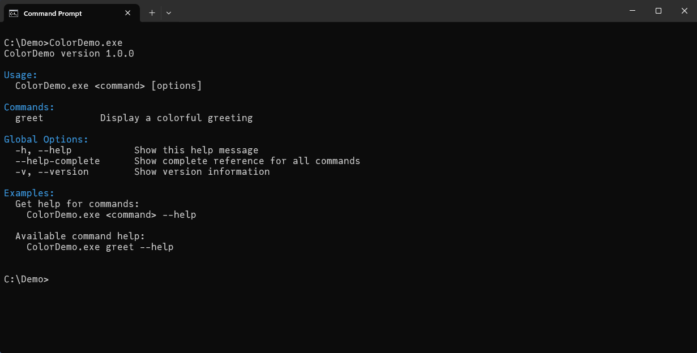
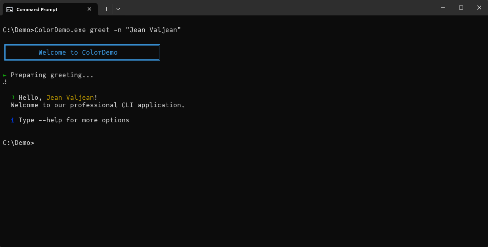

# Command-Line Interface Framework for Free Pascal 🚀

[](https://opensource.org/licenses/MIT)
[](https://www.freepascal.org/)
[](https://www.lazarus-ide.org/)

A robust toolkit for building command-line (terminal) applications in Free Pascal. Leverage Pascal's strong typing and compile-time checks while creating sophisticated terminal tools with features like `git`-style commands, progress bars, and coloured output for better readability.

Combines Free Pascal's speed and reliability with professional-grade features. The object-oriented design handles the complex parts, letting you focus on your application's logic.

## 📑 Table of Contents

- [Command-Line Interface Framework for Free Pascal 🚀](#command-line-interface-framework-for-free-pascal-)
  - [📑 Table of Contents](#-table-of-contents)
  - [✨ Features](#-features)
  - [🚀 Quick Start](#-quick-start)
  - [🎯 Parameter Types and Validation](#-parameter-types-and-validation)
    - [Basic Types](#basic-types)
    - [Boolean and Flags](#boolean-and-flags)
    - [Path and URL Types](#path-and-url-types)
    - [Complex Types](#complex-types)
    - [Common Features](#common-features)
    - [Validation Rules](#validation-rules)
    - [Usage in Code](#usage-in-code)
  - [📖 Screenshots](#-screenshots)
  - [📖 System Requirements](#-system-requirements)
    - [Tested Environments](#tested-environments)
    - [Theoretical Compatibility](#theoretical-compatibility)
    - [Dependencies](#dependencies)
    - [Build Requirements](#build-requirements)
  - [📖 Documentation](#-documentation)
  - [🎯 Use Cases](#-use-cases)
  - [🤝 Contributing](#-contributing)
  - [📝 License](#-license)
  - [🙏 Acknowledgments](#-acknowledgments)
  - [📞 Contact](#-contact)


## ✨ Features

- 🎯 **Command & Subcommand Support**: Organize complex CLIs with hierarchical commands
- 🔍 **Smart Parameter Handling**: Automatic validation and type checking
- 📊 **Progress Indicators**: Built-in spinners and progress bars
- 🎨 **Colored Output**: Rich console output with basic color support
- 📚 **Comprehensive Help System**: Auto-generated help with examples
- 🛡️ **Type-Safe**: Interface-based design with strong typing
- 🔌 **Extensible**: Easy to extend with custom commands and parameters
- **Modern Command-Line Interface**
  - Subcommand support (e.g., `app repo init`, `app repo clone`)
  - Short and long flags (`-h`, `--help`)
  - Automatic help generation
  - Colored output support
- **Robust Error Handling**
  - Clear error messages for unknown commands and subcommands
  - Validation of command-line flags and parameters
  - Helpful suggestions when errors occur
  - Context-aware help display
- **Developer-Friendly**
  - Interface-based design
  - Easy command registration
  - Extensible parameter system
  - Built-in progress indicators
- **User-Friendly**
  - Consistent help formatting
  - Command suggestions
  - Default values support
  - Required parameter validation

## 🚀 Quick Start

1. **Installation**

No complex build system needed! Just:

```bash
# Clone the repository
git clone https://github.com/yourusername/cli-fp.git

# Copy the source files to your project's directory
```

2. **Use in Your Project**

- Add the source directory to your project's search path (Project -> Project Options ... -> Compiler Options -> Paths -> Other unit files)
- Add the units to your uses clause:

```pascal
uses
  CLI.Interfaces,    // Core interfaces
  CLI.Application,   // Main application framework
  CLI.Command,       // Base command implementation
  CLI.Parameter,     // Parameter handling
  CLI.Progress,      // Optional: Progress indicators
  CLI.Console;       // Optional: Colored console output
```

3. **Create Your First CLI App**

```pascal
program MyApp;

{$mode objfpc}{$H+}{$J-}

uses
  SysUtils,
  CLI.Interfaces,
  CLI.Application,
  CLI.Command;

type
  // Define a new command
  TGreetCommand = class(TBaseCommand)
  public
    function Execute: integer; override;
  end;

  // Define the command's Execute behaviour
  function TGreetCommand.Execute: integer;
  var
    UserName: string;
    PrintCount: string;
    i: integer;
  begin
    // Get parameter values using helper methods
    GetParameterValue('--name', UserName);
    GetParameterValue('--count', PrintCount);

    for i := 1 to StrToIntDef(PrintCount, 1) do
      WriteLn('Hello, ', UserName, '!');

    Result := 0;
  end;

var
  App: ICLIApplication;
  Cmd: TGreetCommand;

  // Main block
begin
  App := CreateCLIApplication('MyApp', '1.0.0');
  Cmd := TGreetCommand.Create('greet', 'Say hello');

  // Add parameters using new helper methods
  Cmd.AddStringParameter('-n', '--name', 'Name to greet', False, 'World');
  Cmd.AddIntegerParameter('-c', '--count', 'Number of times to greet', False, '1');

  // Register the command to the application
  App.RegisterCommand(Cmd);

  // Execute the application
  ExitCode := App.Execute;
end.
```

**Output:**

```
$ ./MyApp.exe greet --name "John" --count 3
Hello, John!
Hello, John!
Hello, John!

$ ./MyApp.exe greet
Hello, World!
```

## 🎯 Parameter Types and Validation

The framework provides comprehensive type-safe parameter handling with built-in validation. Each parameter type has specific behaviors and validation rules:

### Basic Types

```pascal
// String parameter: Any text value
Cmd.AddStringParameter('-n', '--name', 'Name to use', False, 'default');
// Output: -n, --name           Name to use
//        Default: default

// Integer parameter: Whole numbers
Cmd.AddIntegerParameter('-c', '--count', 'Count value', True);
// Output: -c, --count          Count value (required)
// Validates: Must be a valid integer

// Float parameter: Decimal numbers
Cmd.AddFloatParameter('-r', '--rate', 'Rate value', False, '1.0');
// Output: -r, --rate           Rate value
//        Default: 1.0
// Validates: Must be a valid floating-point number
```

### Boolean and Flags

```pascal
// Boolean flag: Presence indicates true
Cmd.AddFlag('-v', '--verbose', 'Enable verbose output');
// Output: -v, --verbose        Enable verbose output
//        Default: true when flag is present

// Boolean parameter: Explicit true/false
Cmd.AddParameter('-d', '--debug', 'Debug mode', False, ptBoolean, 'false');
// Output: -d, --debug          Debug mode
// Validates: Must be 'true' or 'false'
```

### Path and URL Types

```pascal
// File/directory path
Cmd.AddPathParameter('-p', '--path', 'Input file path', True);
// Output: -p, --path           Input file path (required)
// Future: Will validate path exists (planned feature)

// URL with protocol validation
Cmd.AddUrlParameter('-u', '--url', 'Repository URL', True);
// Output: -u, --url            Repository URL (required) (must be a valid URL)
// Validates: Must start with http://, https://, git://, or ssh://
```

### Complex Types

```pascal
// Enumerated values
Cmd.AddEnumParameter('-l', '--level', 'Log level', 'debug|info|warn|error', False, 'info');
// Output: -l, --level          Log level (allowed: debug|info|warn|error)
//        Default: info
// Validates: Value must match one of the allowed options

// Date/time values
Cmd.AddDateTimeParameter('-d', '--date', 'Start date');
// Output: -d, --date           Start date (format: YYYY-MM-DD HH:MM:SS)
// Validates: Must match the date/time format

// Array (comma-separated values)
Cmd.AddArrayParameter('-t', '--tags', 'Tag list', False, 'tag1,tag2');
// Output: -t, --tags           Tag list (comma-separated)
//        Default: tag1,tag2
// Behavior: Values are split on commas

// Password (masked in output)
Cmd.AddPasswordParameter('-k', '--api-key', 'API Key', True);
// Output: -k, --api-key        API Key (required) (value will be masked)
// Behavior: Value is masked in help text and logs
```

### Common Features

All parameter types include:
- **Short and Long Forms**: Each parameter can be accessed via short (-x) or long (--xxx) form
- **Help Text Generation**: Automatic generation of formatted help text with descriptions
- **Default Values**: Optional default values when parameter is not provided
- **Required Flag**: Can be marked as required or optional
- **Type Validation**: Automatic validation based on the parameter type
- **Error Messages**: Clear error messages when validation fails

### Validation Rules

The framework automatically validates parameters:
1. **Required Parameters**: Must be provided by the user
2. **Type Validation**:
   - Integer: Must be a valid whole number
   - Float: Must be a valid decimal number
   - Boolean: Must be 'true' or 'false'
   - URL: Must start with valid protocol
   - DateTime: Must match YYYY-MM-DD HH:MM:SS format
   - Enum: Must match one of the allowed values
3. **Default Values**: Used when parameter is optional and not provided
4. **Error Handling**: Clear error messages with suggestions when validation fails

### Usage in Code

To retrieve parameter values in your command's Execute method:

```pascal
function TMyCommand.Execute: Integer;
var
  StringValue: string;
  IntValue: Integer;
  IsEnabled: Boolean;
begin
  // Get parameter values
  GetParameterValue('--name', StringValue);
  if GetParameterValue('--count', IntValue) then
    // Parameter was provided or has default
  if GetParameterValue('--verbose', IsEnabled) then
    // Flag was present
    
  Result := 0;
end;
```

## 📖 Screenshots



*Above: The ColorDemo example showing professional CLI styling with colors, Unicode characters, and progress indicators.*

## 📖 System Requirements

### Tested Environments
- **Operating System**: Windows 11
- **Compiler**: Free Pascal (FPC) 3.2.2
- **IDE**: Lazarus 3.6

### Theoretical Compatibility
- **Operating Systems**:
  - Windows (7, 8, 10, 11)
  - Linux (Any distribution with FPC support)
  - macOS (with FPC support)
  - FreeBSD
- **Compiler**: Free Pascal 3.2.2 or higher
- **IDE**: Any IDE that supports Free Pascal
  - Lazarus 3.6 or higher
  - VS Code with OmniPascal
  - Other text editors

### Dependencies
- No external dependencies required
- Uses only standard Free Pascal RTL units

### Build Requirements
- Free Pascal Compiler (FPC) 3.2.2+
- Lazarus 3.6+
- Basic development tools (git, terminal, etc)

## 📖 Documentation

- [Beginners Guide](docs/beginners-guide.md): A guide for beginners to get started with the framework
- [User Manual](docs/user-manual.md): Complete guide for using the framework
- [API Reference](docs/api-reference.md): Detailed API reference for the framework
- [Technical Documentation](docs/technical-docs.md): Architecture and implementation details
- [Examples](examples/): Working example applications

## 🎯 Use Cases

Perfect for building:
- Version Control Systems
- Build Tools
- Package Managers
- Development Tools
- System Utilities
- DevOps Tools

## 🤝 Contributing

Contributions are welcome! Please feel free to submit a Pull Request. For major changes, please open an issue first to discuss what you would like to change.

1. Fork the Project
2. Create your Feature Branch (`git checkout -b feature/AmazingFeature`)
3. Commit your Changes (`git commit -m 'Add some AmazingFeature'`)
4. Push to the Branch (`git push origin feature/AmazingFeature`)
5. Open a Pull Request

## 📝 License

This project is licensed under the MIT License - see the [LICENSE](LICENSE) file for details.

## 🙏 Acknowledgments

- Inspired by modern CLI frameworks
- Built with Free Pascal and Lazarus IDE

## 📞 Contact

Your Name - [ikelaiah](https://github.com/ikelaiah)

Project Link: [https://github.com/ikelaiah/cli-fp](https://github.com/ikelaiah/cli-fp) 


