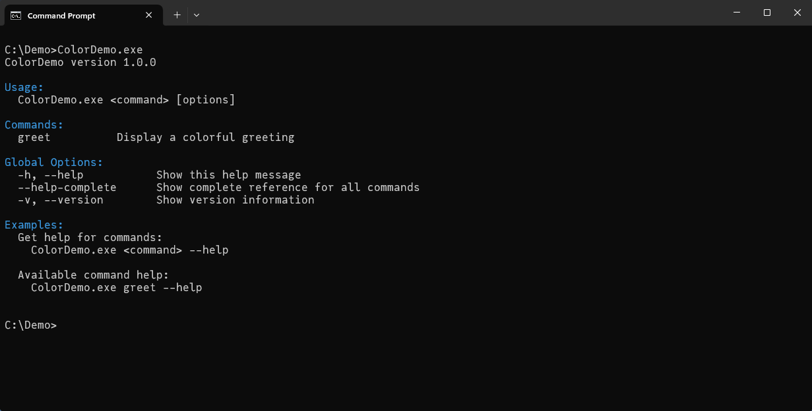
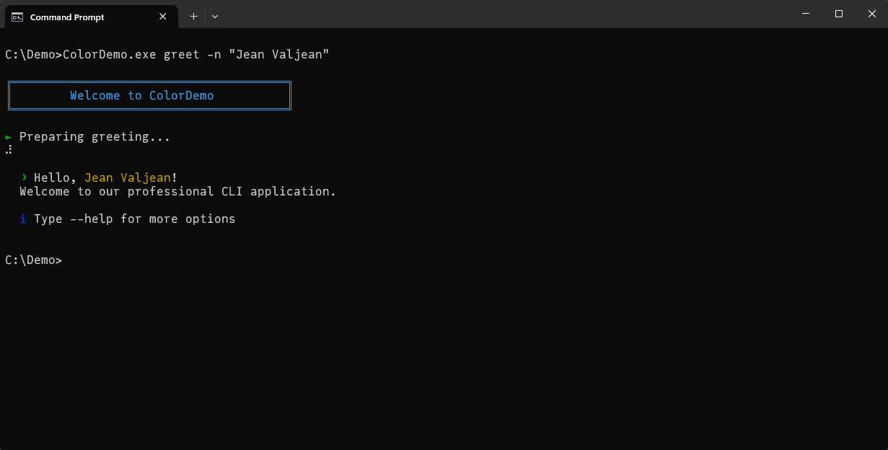

# Command-Line Interface Framework for Free Pascal 🚀

[](https://opensource.org/licenses/MIT)
[](https://github.com/ikelaiah/cli-fp/releases)
[](https://www.freepascal.org/)
[](https://www.lazarus-ide.org/)
[](https://github.com/ikelaiah/cli-fp/stargazers)
[](https://github.com/ikelaiah/cli-fp/issues)

A robust toolkit for building command-line (terminal) applications in Free Pascal. Leverage Pascal's strong typing and compile-time checks while creating sophisticated terminal tools with features like `git`-style commands, progress bars, and coloured output for better readability.

Combines Free Pascal's speed and reliability with professional-grade features. The object-oriented design handles the complex parts, letting you focus on your application's logic.

## 📑 Table of Contents

- [Command-Line Interface Framework for Free Pascal 🚀](#command-line-interface-framework-for-free-pascal-)
  - [📑 Table of Contents](#-table-of-contents)
  - [✨ Features](#-features)
  - [🚀 Quick Start](#-quick-start)
  - [🧩 Project Generator](#-project-generator)
  - [🎯 Parameter Types and Validation](#-parameter-types-and-validation)
    - [Basic Types](#basic-types)
    - [Boolean and Flags](#boolean-and-flags)
    - [Complex Types](#complex-types)
    - [Validation Rules](#validation-rules)
  - [📖 Screenshots](#-screenshots)
  - [📖 System Requirements](#-system-requirements)
    - [Tested Environments](#tested-environments)
    - [Theoretical Compatibility](#theoretical-compatibility)
    - [Dependencies](#dependencies)
    - [Build Requirements](#build-requirements)
  - [📖 Documentation](#-documentation)
  - [🎯 Use Cases](#-use-cases)
  - [🤝 Contributing](#-contributing)
  - [📝 License](#-license)
  - [🙏 Acknowledgments](#-acknowledgments)
  - [� Completion Script Testing](#-completion-script-testing)
  - [🧩 How to Generate Completion Scripts](#-how-to-generate-completion-scripts)
  - [🧩 Bash Completion Script (`--completion-file`)](#-bash-completion-script---completion-file)
  - [🧩 PowerShell Completion Script (`--completion-file-pwsh`)](#-powershell-completion-script---completion-file-pwsh)

## ✨ Features

- 🎯 **Command & Subcommand Support**: Organize complex CLIs with hierarchical commands
- 🔍 **Smart Parameter Handling**: Automatic validation and type checking
- 📊 **Progress Indicators**: Built-in spinners and progress bars with optional status captions
- 🎨 **Colored Output**: Rich console output with basic color support
- 📚 **Comprehensive Help System**: Auto-generated help with examples
- 🛡️ **Type-Safe**: Interface-based design with strong typing
- 🔌 **Extensible**: Easy to extend with custom commands and parameters
- **Modern Command-Line Interface**
  - Subcommand support (e.g., `app repo init`, `app repo clone`)
  - Short and long flags (`-h`, `--help`)
  - Automatic help generation
  - Colored output support
  - **Shell Completion**: Generate completion scripts for Bash (`--completion-file`) and PowerShell (`--completion-file-pwsh`) with automatic value completion for boolean and enum parameters
- **Robust Error Handling**
  - Clear error messages for unknown commands and subcommands
  - Validation of command-line flags and parameters
  - Helpful suggestions when errors occur
  - Context-aware help display
- **Developer-Friendly**
  - Interface-based design
  - Easy command registration
  - Extensible parameter system
  - Built-in progress indicators
- **User-Friendly**
  - Consistent help formatting
  - Command suggestions
  - Default values support
  - Required parameter validation

## 🚀 Quick Start

1. **Installation**

No complex build system needed! Just:

> **Note:** All example builds output their executables and units to the `example-bin/` folder in the repository root for easy access and cleanup.
>
> **Tip:** To build or clean all example projects at once, use the provided scripts:
>
> - On **Linux/macOS**: `./compile-all-examples.sh` and `./clean-all-examples.sh`
> - On **Windows**: `./compile-all-examples.ps1` and `./clean-all-examples.ps1`


```bash
# Clone the repository
git clone https://github.com/ikelaiah/cli-fp.git

# Or copy the source files to your project's directory
```

2. **Use in Your Project**

- Add the source directory to your project's search path (Project -> Project Options ... -> Compiler Options -> Paths -> Other unit files)
- Add the units to your uses clause:

```pascal
uses
  CLI.Interfaces,    // Core interfaces
  CLI.Application,   // Main application framework
  CLI.Command,       // Base command implementation
  CLI.Parameter,     // Parameter handling
  CLI.Progress,      // Optional: Progress indicators
  CLI.Console;       // Optional: Colored console output
```

3. **Create Your First CLI App**

```pascal
program MyApp;

{$mode objfpc}{$H+}{$J-}

uses
  SysUtils,
  CLI.Interfaces,
  CLI.Application,
  CLI.Command;

type
  // Define a new command
  TGreetCommand = class(TBaseCommand)
  public
    function Execute: integer; override;
  end;

  function TGreetCommand.Execute: integer;
  var
    Name: string;
  begin
    // Get parameter value using helper method
    if GetParameterValue('--name', Name) then
      WriteLn('Hello, ', Name, '!')
    else
      WriteLn('Hello, World!');
    Result := 0;
  end;

{ Main program }
var
  App: ICLIApplication;
  Cmd: TGreetCommand;

begin
  App := CreateCLIApplication('MyApp', '1.0.0');
  
  // Create and configure command
  Cmd := TGreetCommand.Create('greet', 'Say hello');
  Cmd.AddStringParameter('-n', '--name', 'Name to greet', False, 'World');
  
  // Register command
  App.RegisterCommand(Cmd);
  
  // Execute application
  ExitCode := App.Execute;
end.
```

**Output:**
```
$ ./myapp greet --name "John"
Hello, John!

$ ./myapp greet
Hello, World!

$ ./myapp greet --help
Usage: myapp greet [options]

Say hello

Options:
  -n, --name           Name to greet
      Default: World
  -h, --help          Show this help message
```

**Lazarus users:**
A runtime-only Lazarus package is provided in `packages/lazarus/cli_fp.lpk`.
To use it, open the `.lpk` file in Lazarus, click “Compile,” then click “Add” to add it to your project’s required packages.

## 🧩 Project Generator

This repository also includes `cli-fp-gen`, a scaffold generator for new `cli-fp` applications.

Typical workflow:

```powershell
fpc -Futools\cli-fp-gen\src .\tools\cli-fp-gen\cli_fp_gen.lpr
.\tools\cli-fp-gen\cli_fp_gen.exe init .\build-temp\myapp --name myapp
.\tools\cli-fp-gen\cli_fp_gen.exe add command greet --project .\build-temp\myapp --description "Say hello"
.\tools\cli-fp-gen\cli_fp_gen.exe generate --project .\build-temp\myapp
```

Full generator documentation, project layout details, and `clifp.json` reference are in [docs/codegen.md](docs/codegen.md).

> **Note:** The generated program file uses PascalCase (e.g. `src/Myapp.lpr`). On Linux/macOS, reference it with the exact same casing in your build scripts. Use `--dry-run` to preview all file operations before committing them.

### Progress Indicator Captions (v1.1.6)

Progress indicators now support inline status text via:
`Update(const Progress: Integer; const ACaption: string = '')`.

```pascal
var
  Spinner: IProgressIndicator;
  Progress: IProgressIndicator;
  i: Integer;
begin
  Spinner := CreateSpinner(ssLine);
  Spinner.Start;
  try
    for i := 1 to 3 do
    begin
      Spinner.Update(0, Format('Preparing step %d/3', [i]));
      Sleep(200);
    end;
  finally
    Spinner.Stop;
  end;

  Progress := CreateProgressBar(3, 20);
  Progress.Start;
  try
    for i := 1 to 3 do
    begin
      Progress.Update(i, Format('Processed item %d/3', [i]));
      Sleep(200);
    end;
  finally
    Progress.Stop;
  end;
end;
```

## 🎯 Parameter Types and Validation

The framework provides comprehensive type-safe parameter handling with built-in validation:

### Basic Types

```pascal
// String parameter
Cmd.AddStringParameter('-n', '--name', 'Name to greet');

// Integer parameter (required)
Cmd.AddIntegerParameter('-c', '--count', 'Number of items', True);

// Float parameter with default
Cmd.AddFloatParameter('-r', '--rate', 'Processing rate', False, '1.0');
```

### Boolean and Flags

```pascal
// Flag (true when present, false by default)
Cmd.AddFlag('-v', '--verbose', 'Enable verbose output'); // Standard CLI behavior

// Boolean parameter (explicit true/false)
Cmd.AddBooleanParameter('-d', '--debug', 'Enable debug mode', False, 'false');
```

> **Note:** By default, flags created with `AddFlag` are `false` unless present on the command line. If you specify a default value of `'true'`, the flag will be `true` even if not present, which is nonstandard for CLI flags and not recommended unless you have a specific use case.

### Complex Types

```pascal
// DateTime (YYYY-MM-DD HH:MM)
Cmd.AddDateTimeParameter('-d', '--date', 'Start date');

// Enum with allowed values
Cmd.AddEnumParameter('-l', '--level', 'Log level', 'debug|info|warn|error');

// URL with protocol validation
Cmd.AddUrlParameter('-u', '--url', 'Repository URL');

// Array (comma-separated)
Cmd.AddArrayParameter('-t', '--tags', 'Tag list');

// Password (masked in output)
Cmd.AddPasswordParameter('-k', '--api-key', 'API Key');
```

### Validation Rules

Each parameter type has built-in validation:

- `String`: No validation
- `Integer`: Must be a valid integer number
- `Float`: Must be a valid floating-point number
- `Boolean`: Must be 'true' or 'false' (case-insensitive)
- `DateTime`: Must be in format "YYYY-MM-DD HH:MM" (24-hour)
- `Enum`: Must match one of the pipe-separated allowed values
- `URL`: Must start with http://, https://, git://, or ssh://
- `Array`: No validation on individual items
- `Password`: No validation, but value is masked in output

## 📖 Screenshots



*Above: The ColorDemo example showing professional CLI styling with colors, Unicode characters, and progress indicators.*

## 📖 System Requirements

### Tested Environments

- **Operating System**: Windows 11, Ubuntu 24.04
- **Compiler**: Free Pascal (FPC) 3.2.2
- **IDE**: Lazarus 3.6, Lazarus 4.0

### Theoretical Compatibility

- **Operating Systems**:
  - Windows (7, 8, 10, 11)
  - Linux (Any distribution with FPC support)
  - macOS (with FPC support)
  - FreeBSD
- **Compiler**: Free Pascal 3.2.2 or higher
- **IDE & Editor**: Any IDE that supports Free Pascal
  - Lazarus 3.6 or higher
  - VS Code with Pascal extensions
  - Other text editors

### Dependencies

- No external dependencies required
- Uses only standard Free Pascal RTL units

### Build Requirements

- Free Pascal Compiler (FPC) 3.2.2+
- Lazarus 3.6+
- Basic development tools (git, terminal, etc)

## 📖 Documentation

- [User Manual](docs/user-manual.md): Complete guide for using the framework, *including a cheat sheet*
- [API Reference](docs/api-reference.md): Detailed API reference for the framework
- [Technical Documentation](docs/technical-docs.md): Architecture and implementation details
- [Code Generator](docs/codegen.md): `cli-fp-gen` usage, generated layout, and verification notes
- [Examples](examples/): Working example applications
- [Changelog](CHANGELOG.md): Version history and updates

## 🎯 Use Cases

Perfect for building:

- Version Control Systems
- Build Tools
- Package Managers
- Development Tools
- System Utilities
- DevOps Tools

## 🤝 Contributing

Contributions are welcome! Please feel free to submit a Pull Request. For major changes, please open an issue first to discuss what you would like to change.

1. Fork the Project
2. Create your Feature Branch (`git checkout -b feature/AmazingFeature`)
3. Commit your Changes (`git commit -m 'Add some AmazingFeature'`)
4. Push to the Branch (`git push origin feature/AmazingFeature`)
5. Open a Pull Request

## 📝 License

This project is licensed under the MIT License - see the [LICENSE](LICENSE) file for details.

## 🙏 Acknowledgments

- Inspired by modern CLI frameworks
- Built with Free Pascal and Lazarus IDE
- Thanks to the Free Pascal community for their support and contributions

## 🧪 Completion Script Testing

- **Bash Completion**: Tested on Bash 4.4.23 via Git Bash (Windows)
  - **30/30 manual test cases passing (100%)**
  - All root-level, command, subcommand, and flag completions verified
  - See [BASH_COMPLETION_GUIDE.md](docs/completion-testing/BASH_COMPLETION_GUIDE.md) for user guide
  - See [BASH_COMPLETION_TESTS.md](docs/completion-testing/BASH_COMPLETION_TESTS.md) for test suite

- **PowerShell Completion**: Tested on PowerShell 7.5.4 (Windows)
  - **30/30 manual test cases passing (100%)**
  - All completion features working as designed
  - See [PS_COMPLETION_GUIDE.md](docs/completion-testing/PS_COMPLETION_GUIDE.md) for user guide
  - See [PS_COMPLETION_TESTS.md](docs/completion-testing/PS_COMPLETION_TESTS.md) for test suite

> **Full Documentation:** All test documentation, guides, and analysis available in [docs/completion-testing/](docs/completion-testing/)
>
> **Tip:** To check your PowerShell version, run:
> ```powershell
> $PSVersionTable.PSVersion
> ```

## 🧩 How to Generate Completion Scripts

- **Bash:**
  ```bash
  ./yourcli --completion-file > myapp-completion.sh
  ```
- **PowerShell:**
  ```powershell
  ./yourcli.exe --completion-file-pwsh > myapp-completion.ps1
  ```

### 💡 Completion Behavior Note

**Commands First Design:** When you press TAB at the root level without typing anything, completion shows **commands only**, not flags. To see flags, type `-` or `--` first:

```bash
# Shows commands only
./yourcli [TAB]

# Shows all flags
./yourcli --[TAB]
./yourcli -[TAB]
```

This intentional design keeps the initial suggestions focused on the most common workflow (choosing a command first), while keeping flags easily accessible with a prefix. This behavior is consistent across both Bash and PowerShell.

## 🧩 Bash Completion Script (`--completion-file`)

Generate a Bash completion script for your CLI with:

```bash
./yourcli --completion-file > myapp-completion.sh
```

- **Root level:** All global flags (`--help`, `-h`, `--help-complete`, `--version`, `--completion-file`) are offered.
- **Subcommands:** Only `-h` and `--help` are offered as global flags.
- **Completions are always context-aware**—only valid subcommands and parameters for the current path are suggested.
- **Automatic value completion:** Boolean parameters automatically complete with `true`/`false`, and enum parameters complete with their allowed values.

> This matches the CLI's actual argument parsing and ensures completions are always valid. See the user manual for full details and safe usage instructions.

## 🧩 PowerShell Completion Script (`--completion-file-pwsh`)

Generate a PowerShell completion script for your CLI with:

```powershell
./yourcli.exe --completion-file-pwsh > myapp-completion.ps1
```

- **Context-aware:** Tab completion for all commands, subcommands, and flags at every level
- **No file fallback:** Only valid completions are shown (never files)
- **Automatic value completion:** Boolean parameters automatically complete with `true`/`false`, and enum parameters complete with their allowed values.
- **Works in PowerShell 7.5+** (cross-platform)

> See the user manual for setup and usage details.
