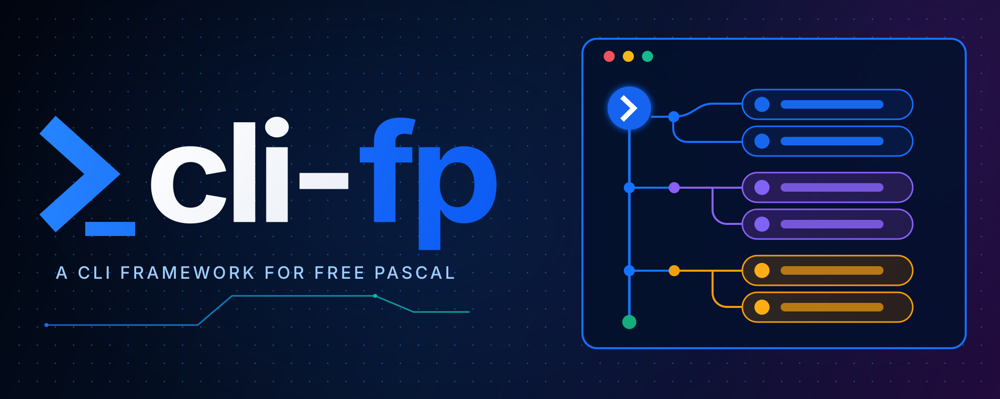

# ⚡ cli-fp: Native CLIs for Free Pascal

[](https://github.com/ikelaiah/cli-fp/blob/main/LICENSE)
[](https://www.freepascal.org/)
[](https://github.com/ikelaiah/cli-fp/blob/main/packages/lazarus/cli_fp.lpk)


[](https://github.com/ikelaiah/cli-fp/blob/main/CHANGELOG.md)
[](https://ikelaiah.github.io/cli-fp/)
[](https://github.com/ikelaiah/cli-fp/actions/workflows/tests.yml)

`cli-fp` is a small Free Pascal framework for native command-line programs. It
provides command trees, validated options, generated help and shell completion,
colours, spinners, and progress bars—without third-party runtime dependencies.

## Prerequisites

- Install [Free Pascal](https://www.freepascal.org/download.html); FPC 3.2.2 is
  the tested repository version. Check it with `fpc -iV`.
- Put the `fpc` executable on your `PATH` so the compiler command works from a
  terminal.
- [Lazarus](https://www.lazarus-ide.org/) is optional. It can use the supplied
  package at `packages/lazarus/cli_fp.lpk`.

If you start in an empty folder, copy the QuickStartDemo source and compile it
with a unit search path pointing at the cloned library:

```bash
fpc -Fu/path/to/cli-fp/src QuickStartDemo.lpr
```

`-Fu` means “add this directory to FPC's unit search path.” If compilation
reports `Fatal: Can't find unit CLI.Interfaces`, the path is missing or points
to the wrong checkout. In Lazarus, install/open `packages/lazarus/cli_fp.lpk`
to provide the same unit path through the IDE.

## Your first CLI

This complete root-command program is also
[QuickStartDemo](https://github.com/ikelaiah/cli-fp/blob/main/examples/QuickStartDemo/QuickStartDemo.lpr), compiled by the
Windows and Linux example smoke checks.

```pascal
program QuickStartDemo;

{$mode objfpc}{$H+}{$J-}

uses
  CLI.Interfaces, CLI.Application, CLI.Command;

type
  THelloCommand = class(TBaseCommand)
  public
    function Execute: Integer; override;
  end;

function THelloCommand.Execute: Integer;
var
  PersonName: string;
begin
  if not GetParameterValue('--name', PersonName) then
    PersonName := 'World';
  WriteLn('Hello, ', PersonName, '!');
  Result := 0;
end;

var
  App: ICLIApplication;
  Main: THelloCommand;
begin
  Main := THelloCommand.Create('', 'Print a greeting');
  Main.AddStringParameter('-n', '--name', 'Name to greet', False, 'World');
  App := CreateCLIApplication('hello', '1.0.0', Main);
  Halt(App.Execute);
end.
```

Clone the repository, enter it, then build and run (Bash):

```bash
git clone https://github.com/ikelaiah/cli-fp.git
cd cli-fp
fpc -Fu./src ./examples/QuickStartDemo/QuickStartDemo.lpr
./examples/QuickStartDemo/QuickStartDemo --name Ada
```

```console
$ ./examples/QuickStartDemo/QuickStartDemo --name Ada
Hello, Ada!
```

PowerShell equivalent:

```powershell
git clone https://github.com/ikelaiah/cli-fp.git
Set-Location cli-fp
fpc "-Fu.\src" .\examples\QuickStartDemo\QuickStartDemo.lpr
.\examples\QuickStartDemo\QuickStartDemo.exe --name Ada
```

The empty name in `THelloCommand.Create('', ...)` marks the root/default
command, so no command name is needed before `--name`.
`CreateCLIApplication('hello', ...)` sets display metadata; it does not rename
the binary. FPC builds `QuickStartDemo` (Windows: `QuickStartDemo.exe`).
The factory constructs the application; `App.Execute` parses and validates
arguments, handles built-ins, and dispatches the selected command.
Keep the command and application references and let the `ICLIApplication` own
the registered command tree; do not manually free registered commands.
`Halt(App.Execute)` is the beginner-recommended program tail.

Quick self-checks are:

```bash
./examples/QuickStartDemo/QuickStartDemo --help
./examples/QuickStartDemo/QuickStartDemo --version
./examples/QuickStartDemo/QuickStartDemo --name Ada
```

```powershell
.\examples\QuickStartDemo\QuickStartDemo.exe --help
.\examples\QuickStartDemo\QuickStartDemo.exe --version
.\examples\QuickStartDemo\QuickStartDemo.exe --name Ada
```

These show generated usage, `hello version 1.0.0`, and `Hello, Ada!`,
respectively, with exit status 0. Throughout the guides, `tool` and `myapp`
stand for your compiled executable; use its actual path.

## Choose a CLI shape

| Shape | Invocation | Start with |
| --- | --- | --- |
| One default action | `hello --name Ada` | [Root command](docs/commands.md#root-command) |
| Named commands | `tool greet --name Ada` | [Named command](docs/commands.md#named-command) |
| Nested commands | `tool repo clone --url …` | [Subcommand](docs/commands.md#subcommand) |

## Documentation

- [Documentation site](https://ikelaiah.github.io/cli-fp/) — navigate by goal.
- [Your first cli-fp program](docs/getting-started.md) — compile and understand
  the example above.
- [How do I...?](docs/how-to.md) — short recipes for options, output,
  completion, the generator, and debugging.
- [Current limitations](docs/limitations.md) — find the supported boundaries.
- [API reference](docs/api-reference.md) — look up public signatures.
- [Technical documentation](docs/technical-docs.md) — architecture and
  maintainer material.

## Examples and generator

The [runnable examples](docs/examples.md) progress from QuickStartDemo through
root, named, nested, error-handling, colour, and progress applications. They
are compiled by the cross-platform cleanup smoke checks.

Use [`cli-fp-gen`](docs/codegen.md) when a larger command tree benefits from a
scaffolded project layout. It is optional; the program above is the shortest
way to start.

## Platform notes

- Windows and Linux run the repository's CI checks.
- The runtime has no third-party dependencies. The generator uses FCL JSON
  units.
- Pascal identifiers, including unit names, are case-insensitive. Linux paths
  and filenames are case-sensitive: use the files' actual paths and FPC's
  unit-file lookup conventions (this repository uses lowercase unit files).

## Contributing

See the [contribution guide](https://github.com/ikelaiah/cli-fp/blob/main/CONTRIBUTING.md). On Windows, run:

```powershell
powershell -ExecutionPolicy Bypass -File tests\run_tests.ps1
powershell -ExecutionPolicy Bypass -File tests\codegen\run_all_tests.ps1
powershell -ExecutionPolicy Bypass -File tests\run_cleanup_smoke.ps1
```

The Bash equivalents and the full project map are in the contribution guide.

## License

`cli-fp` is available under the [MIT License](https://github.com/ikelaiah/cli-fp/blob/main/LICENSE).
