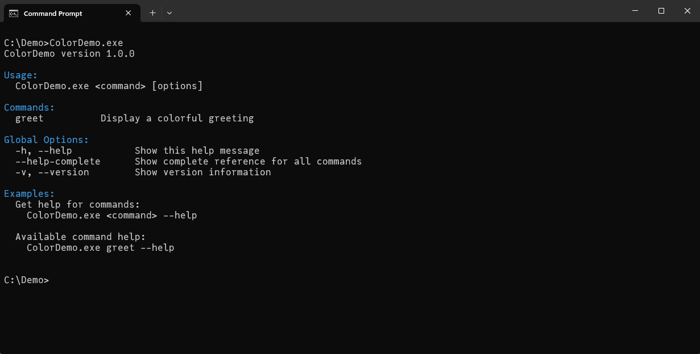
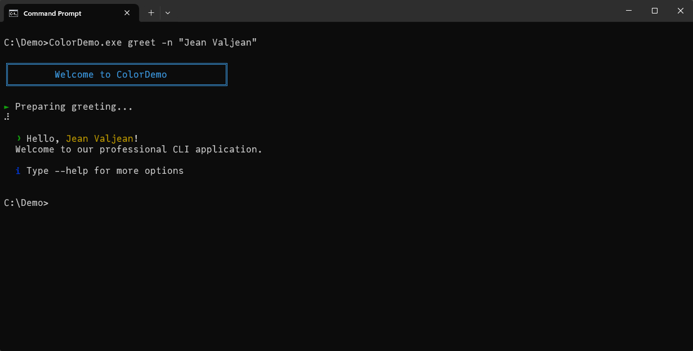

# Command-Line Interface Framework for Free Pascal 🚀

[](https://opensource.org/licenses/MIT)
[](https://github.com/ikelaiah/cli-fp/releases)
[](https://www.freepascal.org/)
[](https://www.lazarus-ide.org/)
[](https://github.com/ikelaiah/cli-fp/stargazers)
[](https://github.com/ikelaiah/cli-fp/issues)

`cli-fp` is a Free Pascal framework for building terminal applications. It
provides `git`-style commands, typed parameters, generated help, shell
completion, progress indicators, and coloured output so your application code
can focus on what each command actually does.

Free Pascal 3.2.2 or newer is recommended. You can use the project generator
for a new application, add the framework units to an existing project, or
install the included Lazarus package.

## Start Here

- **Creating a new CLI application?** Start with the
  [project generator](#-project-generator-fastest-start). It creates the
  project structure, command units, and a `clifp.json` specification for you.
- **Adding CLI features to an existing Pascal project?** Follow the
  [manual quick start](#manual-quick-start).
- **Using Lazarus?** Compile `packages/lazarus/cli_fp.lpk`, then add it to your
  project's required packages.

If this is your first Free Pascal project, install FPC first and confirm that
`fpc -iV` works in your terminal.

## Choose Your CLI Shape

Use a root command for a focused utility, named commands for a `git`-style
application, or combine both:

| Invocation | What runs | Option ownership |
| --- | --- | --- |
| `MyApp` | Root action with its defaults | Root command |
| `MyApp --name Gus` | Root action | Root command |
| `MyApp about` | Named `about` command | `about` command |
| `MyApp about --verbose` | Named `about` command | `about` command |
| `MyApp --help` | Framework help | Application-global |

Root options belong to the default action; they are not automatically inherited
by named commands. Standalone application requests such as `--help`,
`--version`, and completion-script generation take precedence over root
execution.

## 📑 Table of Contents

- [Start Here](#start-here)
- [Choose Your CLI Shape](#choose-your-cli-shape)
- [✨ Features](#-features)
- [🧩 Project Generator: Fastest Start](#-project-generator-fastest-start)
- [Manual Quick Start](#manual-quick-start)
- [🌱 Root Commands](#-root-commands)
- [🎯 Parameter Types and Validation](#-parameter-types-and-validation)
  - [Basic Types](#basic-types)
  - [Boolean and Flags](#boolean-and-flags)
  - [Complex Types](#complex-types)
  - [Validation Rules](#validation-rules)
- [🧩 Shell Completion](#-shell-completion)
- [📖 Screenshots](#-screenshots)
- [📖 System Requirements](#-system-requirements)
  - [Tested Environments](#tested-environments)
  - [Theoretical Compatibility](#theoretical-compatibility)
  - [Dependencies](#dependencies)
  - [Build Requirements](#build-requirements)
- [📖 Documentation](#-documentation)
- [🎯 Use Cases](#-use-cases)
- [🤝 Contributing](#-contributing)
- [📝 License](#-license)
- [🙏 Acknowledgments](#-acknowledgments)

## ✨ Features

- **Commands and subcommands:** Build command trees such as
  `app repo clone`.
- **Optional root commands:** Build command-less applications that run as
  `app [options]` while retaining named commands when needed.
- **Typed parameter metadata:** Define strings, numbers, paths, URLs, enums,
  passwords, arrays, booleans, and date/time values, with type-specific
  validation where the framework provides it.
- **Helpful terminal UX:** Generate contextual help, defaults, required-value
  errors, and suggestions for unknown commands.
- **Shell completion:** Generate Bash and PowerShell completion scripts,
  including boolean and enum value completion.
- **Console tools:** Use coloured output, spinners, and progress bars with
  optional status captions.
- **Project generation:** Scaffold a new application and add or remove command
  units with `cli-fp-gen`.
- **Pascal-friendly design:** Use strongly typed interfaces and ordinary FPC
  units without a separate runtime dependency.

## 🧩 Project Generator: Fastest Start

For a new application, the generator provides the shortest path to a compiling
project. Run these commands from the `cli-fp` repository root.

### Linux/macOS (Bash)

```bash
fpc -Futools/cli-fp-gen/src tools/cli-fp-gen/cli_fp_gen.lpr
./tools/cli-fp-gen/cli_fp_gen init ./build-temp/myapp --name myapp
cd build-temp/myapp
fpc -Fu../../src -Fu./src -Fu./src/generated -Fu./src/commands ./src/Myapp.lpr
./src/Myapp greet --help
```

### Windows (PowerShell)

```powershell
fpc "-Futools\cli-fp-gen\src" .\tools\cli-fp-gen\cli_fp_gen.lpr
.\tools\cli-fp-gen\cli_fp_gen.exe init .\build-temp\myapp --name myapp
Set-Location .\build-temp\myapp
fpc "-Fu..\..\src" "-Fu.\src" "-Fu.\src\generated" "-Fu.\src\commands" .\src\Myapp.lpr
.\src\Myapp.exe greet --help
```

The generated project contains a working `greet` command and a `clifp.json`
specification. Add commands through the generator, or edit the specification
and regenerate:

```text
cli-fp-gen add command status --project <project> --description "Show status"
cli-fp-gen generate --project <project>
```

To generate a command-less application, add a top-level `rootCommand` object to
`clifp.json`:

```json
{
  "schemaVersion": 1,
  "app": {
    "name": "myapp",
    "version": "0.1.0",
    "programFile": "src/Myapp.lpr"
  },
  "rootCommand": {
    "description": "Greet someone",
    "parameters": [
      {
        "kind": "string",
        "short": "-n",
        "long": "--name",
        "description": "Name to greet",
        "required": false,
        "default": "World",
        "allowedValues": ""
      }
    ]
  },
  "commands": []
}
```

Running `generate` creates a user-owned `<App>_RootCommand.pas` implementation
stub and wires it into the generated application. The object deliberately has
no `name` or `parent`.

See the [generator guide](docs/codegen.md) for the complete schema, generated
layout, file-ownership rules, and additional commands. Generated Pascal
filenames use exact casing, such as `src/Myapp.lpr`; preserve that casing on
Linux and macOS.

## Manual Quick Start

1. **Get the source**

```bash
git clone https://github.com/ikelaiah/cli-fp.git
```

You can also download a release archive. Keep the repository's `src/`
directory available to your project.

2. **Add the framework to your project**

Add `cli-fp/src` to FPC's unit search path with `-Fu`, or in Lazarus open
**Project → Project Options → Compiler Options → Paths → Other unit files**.
Then add the units you need:

```pascal
uses
  CLI.Interfaces,    // Core interfaces
  CLI.Application,   // Main application framework
  CLI.Command,       // Base command implementation
  CLI.Parameter,     // Parameter handling
  CLI.Progress,      // Optional: Progress indicators
  CLI.Console;       // Optional: Colored console output
```

3. **Create your first CLI app**

```pascal
program MyApp;

{$mode objfpc}{$H+}{$J-}

uses
  SysUtils,
  CLI.Interfaces,
  CLI.Application,
  CLI.Command;

type
  // Define a new command
  TGreetCommand = class(TBaseCommand)
  public
    function Execute: integer; override;
  end;

  function TGreetCommand.Execute: integer;
  var
    PersonName: string;
  begin
    // Get parameter value using helper method
    if GetParameterValue('--name', PersonName) then
      WriteLn('Hello, ', PersonName, '!')
    else
      WriteLn('Hello, World!');
    Result := 0;
  end;

{ Main program }
var
  App: ICLIApplication;
  Cmd: TGreetCommand;

begin
  App := CreateCLIApplication('MyApp', '1.0.0');
  
  // Create and configure command
  Cmd := TGreetCommand.Create('greet', 'Say hello');
  Cmd.AddStringParameter('-n', '--name', 'Name to greet', False, 'World');
  
  // Register command
  App.RegisterCommand(Cmd);
  
  // Execute application
  Halt(App.Execute);
end.
```

Save the file as `MyApp.lpr`. If the `cli-fp` repository is next to your
project directory, compile and run it with:

```bash
fpc -Fu../cli-fp/src MyApp.lpr
./MyApp greet --name "John"
```

On Windows, run the generated executable as `.\MyApp.exe`.

**Output:**
```
$ ./MyApp greet --name "John"
Hello, John!

$ ./MyApp greet
Hello, World!

$ ./MyApp greet --help
Usage: MyApp greet [options]

Say hello

Options:
  -n, --name           Name to greet
      Default: World
  -h, --help          Show this help message
```

**Lazarus users:**
A runtime-only Lazarus package is provided in `packages/lazarus/cli_fp.lpk`.
To use it, open the `.lpk` file in Lazarus, click “Compile,” then click “Add” to add it to your project’s required packages.

## 🌱 Root Commands

A root command is the application's unnamed default action. It lets a focused
utility run with defaults or accept options directly after the executable,
without inventing a command name solely to hold those options:

```text
MyApp
MyApp --name Gus
```

It is still an ordinary command, so its options use the same parameter,
validation, help, and completion APIs as named commands. Create it with an
empty name and pass it to the three-argument application factory:

```pascal
var
  App: ICLIApplication;
  RootCommand: TGreetCommand;
begin
  RootCommand := TGreetCommand.Create('', 'Greet someone');
  RootCommand.AddStringParameter('-n', '--name', 'Name to greet',
    False, 'World');

  App := CreateCLIApplication('MyApp', '1.0.0', RootCommand);
  Halt(App.Execute);
end.
```

The root command is explicit and optional. Applications using the existing
two-argument `CreateCLIApplication` continue to show general help when invoked
without a named command.

With a root command configured, no arguments or a leading root option selects
the root action. A registered command name still selects that named command.
Root parameters are not application-global and are not automatically available
to named commands. The framework does not currently model positional arguments
or Cobra-style persistent flags.

Named commands can coexist with a root command:

```text
MyApp --name Gus
MyApp about
```

See [`RootCommandDemo`](examples/RootCommandDemo/RootCommandDemo.lpr) for a
complete example.

## 🎯 Parameter Types and Validation

The framework provides comprehensive type-safe parameter handling with built-in validation:

### Basic Types

```pascal
// String parameter
Cmd.AddStringParameter('-n', '--name', 'Name to greet');

// Integer parameter (required)
Cmd.AddIntegerParameter('-c', '--count', 'Number of items', True);

// Float parameter with default
Cmd.AddFloatParameter('-r', '--rate', 'Processing rate', False, '1.0');
```

### Boolean and Flags

```pascal
// Flag (true when present, false by default)
Cmd.AddFlag('-v', '--verbose', 'Enable verbose output'); // Standard CLI behavior

// Boolean parameter (explicit true/false)
Cmd.AddBooleanParameter('-d', '--debug', 'Enable debug mode', False, 'false');
```

> **Note:** By default, flags created with `AddFlag` are `false` unless present on the command line. If you specify a default value of `'true'`, the flag will be `true` even if not present, which is nonstandard for CLI flags and not recommended unless you have a specific use case.

### Complex Types

```pascal
// DateTime (YYYY-MM-DD HH:MM)
Cmd.AddDateTimeParameter('-d', '--date', 'Start date');

// Enum with allowed values
Cmd.AddEnumParameter('-l', '--level', 'Log level', 'debug|info|warn|error');

// URL with protocol validation
Cmd.AddUrlParameter('-u', '--url', 'Repository URL');

// File or directory path
Cmd.AddPathParameter('-p', '--path', 'Target path');

// Array (comma-separated)
Cmd.AddArrayParameter('-t', '--tags', 'Tag list');

// Password (stored as a string; handle it as sensitive data)
Cmd.AddPasswordParameter('-k', '--api-key', 'API Key');
```

### Validation Rules

Each parameter type has built-in validation:

- `String`: No validation
- `Integer`: Must be a valid integer number
- `Float`: Must be a valid floating-point number
- `Flag`: Presence sets the value; absent flags use their default
- `Boolean`: Must be 'true' or 'false' (case-insensitive)
- `DateTime`: Parsed with `TryStrToDateTime`; `YYYY-MM-DD HH:MM` is the recommended portable input
- `Enum`: Must match one of the pipe-separated allowed values
- `URL`: Must start with http://, https://, git://, or ssh://
- `Path`: No path-existence validation
- `Array`: No validation on individual items
- `Password`: No validation or automatic output redaction

## 🧩 Shell Completion

Generate a completion script from your application:

```bash
./yourcli --completion-file > myapp-completion.sh
```

```powershell
.\yourcli.exe --completion-file-pwsh > myapp-completion.ps1
```

Completion is context-aware for root options, commands, subcommands, and their
parameters. Boolean values complete as `true` or `false`, and enum values use
their configured choices. At an empty root prompt, named commands are suggested
first; type `-` or `--` to request root and global options.

See the [user manual](docs/user-manual.md#bash-completion) for safe installation
instructions and [`docs/completion-testing/`](docs/completion-testing/) for the
detailed Bash and PowerShell verification guides.

## 📖 Screenshots



*Above: The ColorDemo example showing professional CLI styling with colors, Unicode characters, and progress indicators.*

## 📖 System Requirements

### Tested Environments

- **Operating System**: Windows 11, Ubuntu 24.04
- **Compiler**: Free Pascal (FPC) 3.2.2
- **IDE**: Lazarus 3.6, Lazarus 4.0

### Theoretical Compatibility

- **Operating Systems**:
  - Windows (7, 8, 10, 11)
  - Linux (Any distribution with FPC support)
  - macOS (with FPC support)
  - FreeBSD
- **Compiler**: Free Pascal 3.2.2 or higher
- **IDE & Editor**: Any IDE that supports Free Pascal
  - Lazarus 3.6 or higher
  - VS Code with Pascal extensions
  - Other text editors

### Dependencies

- No external dependencies required
- Uses only standard Free Pascal RTL units

### Build Requirements

- Free Pascal Compiler (FPC) 3.2.2+
- Lazarus 3.6+ only when using the Lazarus IDE or package
- Git only when cloning the repository rather than using a release archive

## 📖 Documentation

- [User Manual](docs/user-manual.md): Complete guide for using the framework, *including a cheat sheet*
- [API Reference](docs/api-reference.md): Detailed API reference for the framework
- [Technical Documentation](docs/technical-docs.md): Architecture and implementation details
- [Code Generator](docs/codegen.md): `cli-fp-gen` usage, generated layout, and verification notes
- [Examples](examples/): Working example applications
- [Changelog](CHANGELOG.md): Version history and updates

## 🎯 Use Cases

Perfect for building:

- Version Control Systems
- Build Tools
- Package Managers
- Development Tools
- System Utilities
- DevOps Tools

## 🤝 Contributing

Contributions are welcome! Please feel free to submit a Pull Request. For major changes, please open an issue first to discuss what you would like to change.

1. Fork the Project
2. Create your Feature Branch (`git checkout -b feature/AmazingFeature`)
3. Commit your Changes (`git commit -m 'Add some AmazingFeature'`)
4. Push to the Branch (`git push origin feature/AmazingFeature`)
5. Open a Pull Request

## 📝 License

This project is licensed under the MIT License - see the [LICENSE](LICENSE) file for details.

## 🙏 Acknowledgments

- Inspired by modern CLI frameworks
- Built with Free Pascal and Lazarus IDE
- Thanks to the Free Pascal community for their support and contributions
