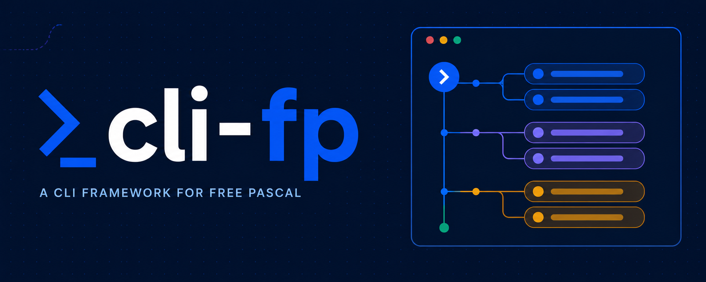

# ⚡ cli-fp: Native CLIs for Free Pascal

[](LICENSE)
[](https://www.freepascal.org/)
[](packages/lazarus/cli_fp.lpk)


[](CHANGELOG.md)
[](#-requirements-and-dependencies)
[](docs/)
[](https://github.com/ikelaiah/cli-fp/actions/workflows/tests.yml)
[](ROADMAP.md)

`cli-fp` is a lightweight framework for building polished native command-line
applications in Free Pascal—with command trees, typed option validation,
generated help and shell completion, colours, spinners, and progress bars, but
no third-party runtime dependencies.

A small CLI stays small:

```pascal
Main := THelloCommand.Create('', 'Print a greeting');
Main.AddStringParameter('-n', '--name', 'Name to greet', False, 'World');

App := CreateCLIApplication('hello', '1.0.0', Main);
Halt(App.Execute);
```

```console
$ ./hello --name Ada
Hello, Ada!
```

## ✨ Why cli-fp?

`cli-fp` keeps the common parts of a command-line application coherent without
hiding the native Pascal program underneath:

- Build one action, named commands, or deeply nested command trees.
- Validate strings, integers, floats, booleans, dates, enumerations, and custom
  values before execution.
- Generate consistent help plus Bash and PowerShell completion from the same
  command definitions.
- Add terminal polish with colours, spinners, progress bars, and debug logging.
- Compile to normal Windows and Linux executables using standard Free Pascal
  units only.
- Use the optional project generator when it helps, or work directly with the
  runtime library.

The public facade remains deliberately small; parsing, validation, help,
completion, and dispatch share the same internal model. See the
[roadmap](ROADMAP.md) for current scope and future work.

## 🚀 Quick start

You need Free Pascal 3.2.2. Install it from the
[official downloads page](https://www.freepascal.org/download.html), or use the
compiler supplied with Lazarus. Check that it is available:

```text
fpc -iV
```

Clone the repository:

```bash
git clone https://github.com/ikelaiah/cli-fp.git
cd cli-fp
```

Create `HelloCLI.lpr` in the repository root:

```pascal
program HelloCLI;

{$mode objfpc}{$H+}{$J-}

uses
  CLI.Interfaces,
  CLI.Application,
  CLI.Command;

type
  THelloCommand = class(TBaseCommand)
  public
    function Execute: Integer; override;
  end;

function THelloCommand.Execute: Integer;
var
  PersonName: string;
begin
  if not GetParameterValue('--name', PersonName) then
    PersonName := 'World';

  WriteLn('Hello, ', PersonName, '!');
  Result := 0;
end;

var
  App: ICLIApplication;
  Main: THelloCommand;
begin
  Main := THelloCommand.Create('', 'Print a greeting');
  Main.AddStringParameter('-n', '--name', 'Name to greet', False, 'World');

  App := CreateCLIApplication('hello', '1.0.0', Main);
  Halt(App.Execute);
end.
```

Compile and run it on Linux or macOS:

```bash
fpc -Fu./src HelloCLI.lpr
./HelloCLI --name Ada
./HelloCLI --help
```

Or with PowerShell on Windows:

```powershell
fpc "-Fu.\src" .\HelloCLI.lpr
.\HelloCLI.exe --name Ada
.\HelloCLI.exe --help
```

The first command prints:

```text
Hello, Ada!
```

This example has one application, one root command, and one option. The command
implements the work, while the framework owns argument parsing, validation,
help, and exit-code handling.

## 🧭 Choose a CLI shape

Use the smallest shape that fits the program:

| Shape | Example | Start with |
| --- | --- | --- |
| One default action | `hello --name Ada` | [RootCommandDemo](examples/RootCommandDemo/RootCommandDemo.lpr) |
| Named commands | `tool greet --name Ada` | [SimpleDemo](examples/SimpleDemo/SimpleDemo.lpr) |
| Nested commands | `tool repo remote add` | [SubCommandDemo](examples/SubCommandDemo/SubCommandDemo.lpr) |

A root command is an unnamed default action. Named commands are registered with
`App.RegisterCommand`, and subcommands are attached to another command with
`AddSubCommand`. Root options belong only to the root action; they are not
global options inherited by named commands.

The framework does not currently model positional arguments or persistent
options shared across a command tree.

## ⚙️ Options and validation

Commands declare option metadata with focused registration methods:

```pascal
Command.AddStringParameter('-n', '--name', 'Name to greet', False, 'World');
Command.AddIntegerParameter('-c', '--count', 'Number of runs', True);
Command.AddFloatParameter('-r', '--rate', 'Processing rate', False, '1.0');
Command.AddFlag('-v', '--verbose', 'Show detailed output');
Command.AddBooleanParameter('-d', '--debug', 'Debug mode', False, 'false');
Command.AddEnumParameter('-l', '--level', 'Log level',
  'debug|info|warn|error', False, 'info');
Command.AddDateTimeParameter('-t', '--time', 'Start time');
Command.AddPathParameter('-p', '--path', 'Target path');
Command.AddUrlParameter('-u', '--url', 'Repository URL');
Command.AddArrayParameter('-a', '--items', 'Comma-separated items');
Command.AddPasswordParameter('-k', '--api-key', 'API key');
```

The framework applies the validation associated with each registered type
before executing the command. The current command API returns values as
strings, so command implementations convert values when necessary:

```pascal
if GetParameterValue('--count', RawCount) and
  TryStrToInt(RawCount, Count) then
  WriteLn('Count: ', Count);
```

`Password` values are stored as strings. Framework debug diagnostics redact
them, but output produced by your command or external logging does not.
`Path` values are not checked for existence. Registered integer and float
options accept negative values in both equals and separated forms, for example
`--count=-1` and `--count -1`. For other value types that begin with `-`, use
the equals form so the value is not interpreted as another option.

See the [user manual](docs/user-manual.md#parameter-types-and-validation) for
the complete registration and validation rules.

## 🧰 Built-in behaviour

Applications receive these framework-level options:

| Option | Behaviour |
| --- | --- |
| `-h`, `--help` | Show application or selected-command help |
| `--help-complete` | Show the complete command reference |
| `-v`, `--version` | Print application version information |
| `--completion-file` | Write a Bash completion script to standard output |
| `--completion-file-pwsh` | Write a PowerShell completion script to standard output |

`--help` and `--version` act at application level when used alone. After a
named command, `--help` describes the selected command. Completion-script
options are handled when they are the first argument.

Generate completion scripts by redirecting that output:

```bash
./yourcli --completion-file > yourcli-completion.sh
```

```powershell
.\yourcli.exe --completion-file-pwsh > yourcli-completion.ps1
```

Completion covers commands, subcommands, options, Boolean values, and enum
choices. Custom completion callbacks are deprecated and non-functional in the
1.x API. See the [completion guide](docs/user-manual.md#bash-completion) for
installation instructions.

## 📚 Examples

Each example is an ordinary Free Pascal program:

| Example | Demonstrates |
| --- | --- |
| [RootCommandDemo](examples/RootCommandDemo/) | A focused utility with a default action |
| [SimpleDemo](examples/SimpleDemo/) | Named commands, options, output, and a spinner |
| [SubCommandDemo](examples/SubCommandDemo/) | Nested command trees |
| [ColorDemo](examples/ColorDemo/) | Colours and terminal presentation |
| [ProgressDemo](examples/ProgressDemo/) | Spinners and progress bars |
| [LongRunningOpDemo](examples/LongRunningOpDemo/) | Longer operations and cleanup |
| [ErrorHandlingDemo](examples/ErrorHandlingDemo/) | Errors and exit behaviour |

Compile an example from the repository root:

```bash
fpc -Fu./src ./examples/RootCommandDemo/RootCommandDemo.lpr
```

In PowerShell, quote the unit search path:

```powershell
fpc "-Fu.\src" .\examples\RootCommandDemo\RootCommandDemo.lpr
```

## 🏗️ Optional project generator

`cli-fp-gen` is scaffolding for applications with larger command trees. It is
not required to use the runtime framework, and it is not the shortest way to
learn the core API.

Build it on Linux or macOS:

```bash
fpc -Futools/cli-fp-gen/src tools/cli-fp-gen/cli_fp_gen.lpr
./tools/cli-fp-gen/cli_fp_gen init ./build-temp/myapp --name myapp
```

Or on Windows:

```powershell
fpc "-Futools\cli-fp-gen\src" .\tools\cli-fp-gen\cli_fp_gen.lpr
.\tools\cli-fp-gen\cli_fp_gen.exe init .\build-temp\myapp --name myapp
```

Generated registry and program files are generator-owned. Command units are
user-owned and are preserved during normal regeneration. Read the
[generator guide](docs/codegen.md) before changing `clifp.json` or generated
files.

## 🦎 Lazarus

A runtime-only package is provided at
[`packages/lazarus/cli_fp.lpk`](packages/lazarus/cli_fp.lpk). Open the package
in Lazarus, compile it, and add it to the project's required packages. Lazarus
is optional when compiling directly with FPC.

## 🛠️ Developing cli-fp

Run the framework tests on Linux or macOS:

```bash
bash tests/run_tests.sh
bash tests/run_cleanup_smoke.sh
```

Run the generator suites:

```bash
bash tests/codegen/run_unit_tests.sh
bash tests/codegen/run_golden_test.sh
bash tests/codegen/run_ops_test.sh
bash tests/codegen/run_compile_smoke.sh
```

On Windows:

```powershell
powershell -ExecutionPolicy Bypass -File tests\run_tests.ps1
powershell -ExecutionPolicy Bypass -File tests\codegen\run_all_tests.ps1
powershell -ExecutionPolicy Bypass -File tests\run_cleanup_smoke.ps1
```

The cleanup smoke check compiles all seven canonical examples in an isolated
copy, runs the cleanup script, and verifies that generated artifacts are
removed without changing tracked files. CI runs the equivalent Bash and
PowerShell checks on Linux and Windows.

CI runs the framework and generator suites on Windows and Linux. See
[CONTRIBUTING.md](CONTRIBUTING.md) for coding style and pull-request guidance.

The framework runners force a complete unit rebuild into a temporary output
directory, so stale non-test `.ppu` files cannot affect the result. Test output
capture is compiled only when `CLI_FP_TESTING` is defined and is absent from
normal runtime builds.

## 🗂️ Repository map

| Path | Purpose |
| --- | --- |
| [`src/`](src/) | Runtime framework units |
| [`examples/`](examples/) | Focused, runnable applications |
| [`tests/`](tests/) | Framework and generator tests |
| [`tools/cli-fp-gen/`](tools/cli-fp-gen/) | Optional JSON-driven project generator |
| [`packages/lazarus/`](packages/lazarus/) | Lazarus runtime package |
| [`docs/`](docs/) | User, API, generator, and technical guides |

## 📋 Requirements and dependencies

- Free Pascal 3.2.2 is the tested compiler version.
- The runtime framework has no third-party dependencies.
- The generator uses the JSON units supplied by the Free Component Library.
- Windows and Linux are tested in CI.
- macOS, FreeBSD, and other FPC-supported Unix systems are expected to work but
  are not currently exercised in CI.

On Debian and Ubuntu, install the compiler and FCL units with:

```bash
sudo apt-get install fp-compiler fp-units-fcl
```

## 📖 Documentation

- [Documentation home](docs/README.md) — choose a guide by goal
- [User manual](docs/user-manual.md) — learn the complete framework
- [API reference](docs/api-reference.md) — look up public types and methods
- [Technical documentation](docs/technical-docs.md) — understand the internals
- [Generator guide](docs/codegen.md) — use and maintain `cli-fp-gen`
- [Roadmap](ROADMAP.md) — planned simplification work
- [Changelog](CHANGELOG.md) — release history
- [v1.3.3 release notes](docs/RELEASE_NOTES_v1.3.3.md) — stabilization changes
  dated 2026-08-14

## 🤝 Contributing

Bug reports, focused fixes, documentation improvements, and small features are
welcome. For larger changes, open an issue first so the public API and
maintenance cost can be discussed before implementation.

## 📄 License

`cli-fp` is available under the [MIT License](LICENSE).
