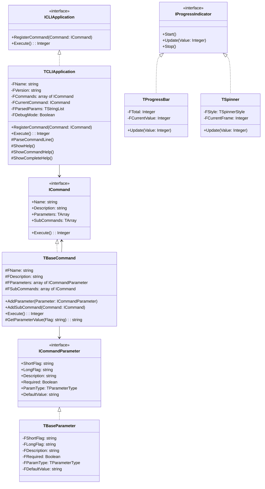

# CLI Framework Technical Documentation

## Architecture Overview

The Free Pascal CLI Framework is built on a modular, interface-based architecture that promotes extensibility and maintainability. The framework is organized into several key components that work together to provide a complete CLI solution.

## Class Diagram



## Core Components

### 1. Interfaces (`CLI.Interfaces`)

#### `ICommand`
```pascal
ICommand = interface
  function GetName: string;
  function GetDescription: string;
  function Execute: Integer;
  function GetParameters: TArray<ICommandParameter>;
  function GetSubCommands: TArray<ICommand>;
  property Name: string read GetName;
  property Description: string read GetDescription;
  property Parameters: TArray<ICommandParameter> read GetParameters;
  property SubCommands: TArray<ICommand> read GetSubCommands;
end;
```

#### `ICommandParameter`
```pascal
ICommandParameter = interface
  function GetShortFlag: string;
  function GetLongFlag: string;
  function GetDescription: string;
  function GetRequired: Boolean;
  function GetParamType: TParameterType;
  function GetDefaultValue: string;
  property ShortFlag: string read GetShortFlag;
  property LongFlag: string read GetLongFlag;
  property Description: string read GetDescription;
  property Required: Boolean read GetRequired;
  property ParamType: TParameterType read GetParamType;
  property DefaultValue: string read GetDefaultValue;
end;
```

#### `IProgressIndicator`
```pascal
IProgressIndicator = interface
  procedure Start;
  procedure Update(const Value: Integer);
  procedure Stop;
end;
```

### 2. Application Core (`CLI.Application`)

The `TCLIApplication` class is the central component that:
- Manages command registration
- Handles command-line parsing
- Implements the help system
- Coordinates command execution

Key methods:
```pascal
TCLIApplication = class(TInterfacedObject, ICLIApplication)
  procedure RegisterCommand(const Command: ICommand);
  function Execute: Integer;
  procedure ParseCommandLine;
  function ValidateCommand: Boolean;
end;
```

### 3. Base Classes

#### `TBaseCommand` (`CLI.Command`)
Base implementation for commands with:
- Parameter management
- Subcommand support
- Parameter value retrieval

#### `TBaseParameter` (`CLI.Parameter`)
Base implementation for command parameters with:
- Flag handling
- Type validation
- Default value support

## Implementation Details

### 1. Command-Line Parsing

The framework uses a sophisticated parsing system that:
- Handles multiple parameter formats
- Supports parameter value extraction
- Validates required parameters
- Applies default values

Key parsing rules:
```pascal
// Long format with equals
--param=value

// Long format with space
--param value

// Short format
-p value

// Boolean flags
--flag
-f
```

### 2. Progress Indicators

Two types of progress indicators are implemented:

#### Spinner
- Uses ASCII/Unicode characters for animation
- Non-blocking operation
- Customizable spinner styles

#### Progress Bar
- Shows percentage completion
- Supports custom total values
- Updates in real-time

### 3. Help System

The help system is implemented in three levels:

1. **Basic Help** (`ShowHelp`)
   - Shows command list
   - Displays global options
   - Provides usage examples

2. **Command Help** (`ShowCommandHelp`)
   - Shows command usage
   - Lists command parameters
   - Displays subcommands
   - Shows command-specific examples

3. **Complete Help** (`ShowCompleteHelp`)
   - Shows full command hierarchy
   - Displays all parameters
   - Includes detailed descriptions

### 4. Color Support

Console colors are implemented through the `TConsole` class:
```pascal
type
  TConsoleColor = (
    ccDefault,
    ccBlack,
    ccRed,
    ccGreen,
    ccYellow,
    ccBlue,
    ccMagenta,
    ccCyan,
    ccWhite
  );
```

## Error Handling

The framework implements robust error handling:

1. **Parameter Validation**
   - Required parameter checks
   - Type validation
   - Default value application

2. **Command Execution**
   - Exception handling
   - Error reporting
   - Exit code management

3. **User Input Validation**
   - Command existence checks
   - Parameter format validation
   - Value type checking

## Performance Considerations

1. **Memory Management**
   - Interface-based reference counting
   - Automatic cleanup of command objects
   - Proper resource disposal

2. **Command Processing**
   - Efficient parameter parsing
   - Minimal string operations
   - Optimized help text generation

## Extension Points

The framework can be extended through:

1. **Custom Commands**
   - Inherit from `TBaseCommand`
   - Implement custom `Execute` method
   - Add specialized parameters

2. **Custom Parameters**
   - Create new parameter types
   - Implement custom validation
   - Add specialized formatting

3. **Custom Progress Indicators**
   - Implement `IProgressIndicator`
   - Create new visualization styles
   - Add custom update logic

## Debug Support

Debug mode provides:
- Parameter parsing details
- Command execution flow
- Error tracking information

Enable with:
```pascal
(App as TCLIApplication).DebugMode := True;
```

## Best Practices for Development

1. **Command Implementation**
   ```pascal
   type
     TMyCommand = class(TBaseCommand)
     public
       constructor Create;
       function Execute: Integer; override;
     end;
   ```

2. **Parameter Definition**
   ```pascal
   Cmd.AddParameter(CreateParameter(
     '-p',
     '--param',
     'Parameter description',
     True,
     ptString,
     'default'
   ));
   ```

3. **Progress Indication**
   ```pascal
   var
     Progress: IProgressIndicator;
   begin
     Progress := CreateProgressBar(Total);
     try
       Progress.Start;
       // Work
     finally
       Progress.Stop;
     end;
   end;
   ```

## Testing Guidelines

1. **Command Testing**
   - Test required parameters
   - Verify help output
   - Check execution results

2. **Parameter Testing**
   - Test various formats
   - Verify validation
   - Check default values

3. **Integration Testing**
   - Test command hierarchy
   - Verify help system
   - Check error handling 