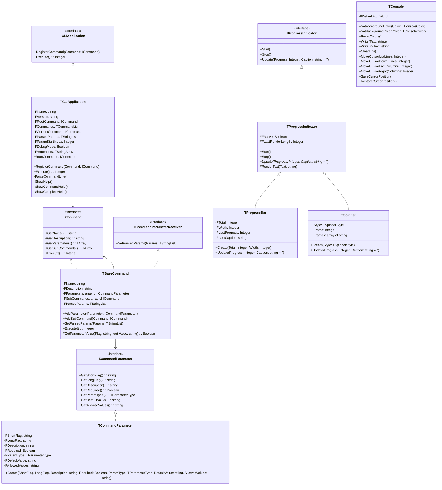

# CLI Framework Technical Documentation

[Documentation home](README.md) · [Project README](../README.md) ·
[User manual](user-manual.md) · [API reference](api-reference.md)

This is a maintainer-level guide to parser flow, object ownership, help and
completion generation, console behaviour, and tests. Application authors
looking for public usage examples should start with the
[user manual](user-manual.md).

## Architecture Overview

The Free Pascal CLI Framework is built on a modular, interface-based architecture that promotes extensibility and maintainability. The framework is organized into several key components that work together to provide a complete CLI solution.


```mermaid
classDiagram
    class ICLIApplication {
        <<interface>>
        +RegisterCommand(Command: ICommand)
        +Execute(): Integer
    }
    
    class ICommand {
        <<interface>>
        +GetName(): string
        +GetDescription(): string
        +GetParameters(): TArray<ICommandParameter>
        +GetSubCommands(): TArray<ICommand>
        +Execute(): Integer
    }

    class ICommandParameterReceiver {
        <<interface>>
        +SetParsedParams(Params: TStringList)
    }
    
    class ICommandParameter {
        <<interface>>
        +GetShortFlag(): string
        +GetLongFlag(): string
        +GetDescription(): string
        +GetRequired(): Boolean
        +GetParamType(): TParameterType
        +GetDefaultValue(): string
        +GetAllowedValues(): string
    }
    
    class IProgressIndicator {
        <<interface>>
        +Start()
        +Stop()
        +Update(Progress: Integer, Caption: string = '')
    }
    
    class TCLIApplication {
        -FName: string
        -FVersion: string
        -FRootCommand: ICommand
        -FCommands: TCommandList
        -FCurrentCommand: ICommand
        -FParsedParams: TStringList
        -FParamStartIndex: Integer
        -FDebugMode: Boolean
        -FArguments: TStringArray
        +RegisterCommand(Command: ICommand)
        +Execute(): Integer
        +RootCommand: ICommand
        -ParseCommandLine()
        -ShowHelp()
        -ShowCommandHelp()
        -ShowCompleteHelp()
    }
    
    class TBaseCommand {
        -FName: string
        -FDescription: string
        -FParameters: array of ICommandParameter
        -FSubCommands: array of ICommand
        -FParsedParams: TStringList
        +AddParameter(Parameter: ICommandParameter)
        +AddSubCommand(Command: ICommand)
        +SetParsedParams(Params: TStringList)
        +Execute(): Integer
        #GetParameterValue(Flag: string, out Value: string): Boolean
    }
    
    class TCommandParameter {
        -FShortFlag: string
        -FLongFlag: string
        -FDescription: string
        -FRequired: Boolean
        -FParamType: TParameterType
        -FDefaultValue: string
        -FAllowedValues: string
        +Create(ShortFlag, LongFlag, Description: string, Required: Boolean, ParamType: TParameterType, DefaultValue: string, AllowedValues: string)
    }
    
    class TProgressIndicator {
        #FActive: Boolean
        #FLastRenderLength: Integer
        +Start()
        +Stop()
        +Update(Progress: Integer, Caption: string = '')*
        #RenderText(Text: string)
    }
    
    class TProgressBar {
        -FTotal: Integer
        -FWidth: Integer
        -FLastProgress: Integer
        -FLastCaption: string
        +Create(Total: Integer, Width: Integer)
        +Update(Progress: Integer, Caption: string = '')
    }
    
    class TSpinner {
        -FStyle: TSpinnerStyle
        -FFrame: Integer
        -FFrames: array of string
        +Create(Style: TSpinnerStyle)
        +Update(Progress: Integer, Caption: string = '')
    }

    class TConsole {
        -FDefaultAttr: Word
        +SetForegroundColor(Color: TConsoleColor)
        +SetBackgroundColor(Color: TConsoleColor)
        +ResetColors()
        +Write(Text: string)
        +WriteLn(Text: string)
        +ClearLine()
        +MoveCursorUp(Lines: Integer)
        +MoveCursorDown(Lines: Integer)
        +MoveCursorLeft(Columns: Integer)
        +MoveCursorRight(Columns: Integer)
        +SaveCursorPosition()
        +RestoreCursorPosition()
    }

    ICLIApplication <|.. TCLIApplication
    ICommand <|.. TBaseCommand
    ICommandParameterReceiver <|.. TBaseCommand
    ICommandParameter <|.. TCommandParameter
    IProgressIndicator <|.. TProgressIndicator
    TProgressIndicator <|-- TProgressBar
    TProgressIndicator <|-- TSpinner
    
    TCLIApplication --> ICommand
    TBaseCommand --> ICommandParameter
    TBaseCommand --> ICommand
```


## Core Components

### 1. Interfaces (`CLI.Interfaces`)

#### `ICommand`
```pascal
ICommand = interface
  function GetName: string;
  function GetDescription: string;
  function GetParameters: specialize TArray<ICommandParameter>;
  function GetSubCommands: specialize TArray<ICommand>;
  function Execute: Integer;
  property Name: string read GetName;
  property Description: string read GetDescription;
  property Parameters: specialize TArray<ICommandParameter> read GetParameters;
  property SubCommands: specialize TArray<ICommand> read GetSubCommands;
end;
```

#### `ICommandParameterReceiver`

`ICommandParameterReceiver` is an optional capability, not a requirement for
all commands. Before validation and execution, `TCLIApplication` uses
`Supports()` to provide its parsed parameter list when the selected command
implements this interface. `TBaseCommand` implements it; a standalone
`ICommand` that does not need framework-managed lookup can execute without it.

```pascal
ICommandParameterReceiver = interface
  procedure SetParsedParams(const Params: TStringList);
end;
```

#### `ICommandParameter`
```pascal
ICommandParameter = interface
  function GetShortFlag: string;
  function GetLongFlag: string;
  function GetDescription: string;
  function GetRequired: Boolean;
  function GetParamType: TParameterType;
  function GetDefaultValue: string;
  function GetAllowedValues: string;
  property ShortFlag: string read GetShortFlag;
  property LongFlag: string read GetLongFlag;
  property Description: string read GetDescription;
  property Required: Boolean read GetRequired;
  property ParamType: TParameterType read GetParamType;
  property DefaultValue: string read GetDefaultValue;
  property AllowedValues: string read GetAllowedValues;
end;
```

#### `IProgressIndicator`
```pascal
IProgressIndicator = interface
  procedure Start;
  procedure Stop;
  procedure Update(const Progress: Integer; const ACaption: string = '');
end;
```

### 2. Application Core (`CLI.Application`)

The `TCLIApplication` class is the central component that:
- Manages command registration
- Holds an optional executable root command
- Handles command-line parsing
- Implements the help system
- Coordinates command execution

Key methods:
```pascal
TCLIApplication = class(TInterfacedObject, ICLIApplication)
private
  FName: string;
  FVersion: string;
  FRootCommand: ICommand;
  FCommands: TCommandList;
  FCurrentCommand: ICommand;
  FParsedParams: TStringList;
  FParamStartIndex: Integer;
  FDebugMode: Boolean;
  FArguments: TStringArray;
public
  procedure RegisterCommand(const Command: ICommand);
  function Execute: Integer;
  property DebugMode: Boolean read FDebugMode write FDebugMode;
  property Version: string read FVersion;
  property RootCommand: ICommand read FRootCommand;
  property Commands: TCommandList read GetCommands;
end;
```

Root-command support is introduced through an overload rather than by changing
`ICLIApplication`, preserving the existing public interface contract:

```pascal
function CreateCLIApplication(const Name, Version: string): ICLIApplication;
function CreateCLIApplication(const Name, Version: string;
  const RootCommand: ICommand): ICLIApplication;
```

At execution time, an empty argument list selects `FRootCommand` when present.
A leading option also selects it after terminal global options have been
handled. A leading non-option token continues through the existing named
command and subcommand resolver. Both paths converge on the same parameter
parsing, validation, and exception handling pipeline.

### 3. Base Classes

#### `TBaseCommand` (`CLI.Command`)
Base implementation for commands with:
```pascal
TBaseCommand = class(TInterfacedObject, ICommand, ICommandParameterReceiver)
private
  FName: string;
  FDescription: string;
  FParameters: array of ICommandParameter;
  FSubCommands: array of ICommand;
  FParsedParams: TStringList;
protected
  function GetParameterValue(const Flag: string; out Value: string): Boolean;
public
  procedure AddParameter(const Parameter: ICommandParameter);
  procedure AddSubCommand(const Command: ICommand);
  procedure SetParsedParams(const Params: TStringList);
  function Execute: Integer; virtual; abstract;
end;
```

#### `TCommandParameter` (`CLI.Parameter`)
Base implementation for command parameters:
```pascal
TCommandParameter = class(TInterfacedObject, ICommandParameter)
private
  FShortFlag: string;
  FLongFlag: string;
  FDescription: string;
  FRequired: Boolean;
  FParamType: TParameterType;
  FDefaultValue: string;
  FAllowedValues: string;
public
  constructor Create(const AShortFlag, ALongFlag, ADescription: string;
    ARequired: Boolean; AParamType: TParameterType;
    const ADefaultValue: string = ''; const AAllowedValues: string = '');
end;
```

### 4. Console Support (`CLI.Console`)

Console color and cursor control:
```pascal
type
  TConsoleColor = (
    ccBlack, ccBlue, ccGreen, ccCyan, 
    ccRed, ccMagenta, ccYellow, ccWhite,
    ccBrightBlack, ccBrightBlue, ccBrightGreen, ccBrightCyan,
    ccBrightRed, ccBrightMagenta, ccBrightYellow, ccBrightWhite
  );

  TConsole = class
  private
    class var FDefaultAttr: Word;
    class procedure InitConsole;
  public
    class procedure SetForegroundColor(const Color: TConsoleColor);
    class procedure SetBackgroundColor(const Color: TConsoleColor);
    class procedure ResetColors;
    class procedure Write(const Text: string); overload;
    class procedure Write(const Text: string; const FgColor: TConsoleColor); overload;
    class procedure WriteLn(const Text: string); overload;
    class procedure WriteLn(const Text: string; const FgColor: TConsoleColor); overload;
    // Cursor control methods
    class procedure ClearLine;
    class procedure MoveCursorUp(const Lines: Integer = 1);
    class procedure MoveCursorDown(const Lines: Integer = 1);
    class procedure MoveCursorLeft(const Columns: Integer = 1);
    class procedure MoveCursorRight(const Columns: Integer = 1);
    class procedure SaveCursorPosition;
    class procedure RestoreCursorPosition;
  end;
```

### 5. Progress Indicators (`CLI.Progress`)

Two types of progress indicators:

#### Spinner
```pascal
type
  TSpinnerStyle = (
    ssDots,    // ⠋⠙⠹⠸⠼⠴⠦⠧⠇⠏
    ssLine,    // -\|/
    ssCircle,  // ◐◓◑◒
    ssSquare,  // ◰◳◲◱
    ssArrow,   // ←↖↑↗→↘↓↙
    ssBounce,  // ⠁⠂⠄⠂
    ssBar      // ▏▎▍▌▋▊▉█▊▋▌▍▎▏
  );

  TSpinner = class(TProgressIndicator)
  private
    FStyle: TSpinnerStyle;
    FFrame: Integer;
    FFrames: array of string;
  public
    constructor Create(const AStyle: TSpinnerStyle);
    procedure Update(const Progress: Integer; const ACaption: string = ''); override;
  end;
```

#### Progress Bar
```pascal
TProgressBar = class(TProgressIndicator)
private
  FTotal: Integer;
  FWidth: Integer;
  FLastProgress: Integer;
  FLastCaption: string;
public
  constructor Create(const ATotal: Integer; const AWidth: Integer = 10);
  procedure Update(const Progress: Integer; const ACaption: string = ''); override;
end;
```

## Error Handling

The framework defines a CLI-specific exception hierarchy:

1. **Exception Classes** (`CLI.Errors`)
```pascal
type
  ECLIException = class(Exception);
  ECommandNotFoundException = class(ECLIException);
  EInvalidParameterException = class(ECLIException);
  ERequiredParameterMissingException = class(ECLIException);
  EInvalidParameterValueException = class(ECLIException);
  ECommandExecutionException = class(ECLIException);
```

These exception types are available to application code, but the current
`TCLIApplication` execution path does not raise them for parser or validation
failures. It writes those errors and returns exit code `1`; command exceptions
are caught as `Exception` and reported as execution errors. Duplicate command
registration currently raises a generic `Exception`.

2. **Parameter Validation**
- Required parameter checks
- Type validation
- Default value application

3. **Command Validation**
- Command existence checks
- Subcommand validation
- Parameter format validation

## Platform-Specific Considerations

### Windows Console Support

Foreground/background colours and colour reset use the Windows console API:

```pascal
{$IFDEF WINDOWS}
  Handle := GetStdHandle(STD_OUTPUT_HANDLE);
  GetConsoleScreenBufferInfo(Handle, Info);
  SetConsoleTextAttribute(Handle, Attributes);
{$ENDIF}
```

Cursor movement and position helpers still emit ANSI control sequences, so
those operations depend on ANSI-compatible terminal behaviour.

### Unix-Like Console Support

On non-Windows targets, colours and cursor control use ANSI escape sequences:

```pascal
{$ELSE}
  System.Write(#27'[<color_code>m');
{$ENDIF}
```

## Best Practices

1. **Command Implementation**
```pascal
type
  TMyCommand = class(TBaseCommand)
  public
    constructor Create;
    function Execute: Integer; override;
  end;
```

2. **Parameter Definition**
```pascal
Cmd.AddParameter(
  '-p',
  '--param',
  'Parameter description',
  True,
  ptString,
  'default'
);
```

3. **Progress Indication**
```pascal
var
  Progress: IProgressIndicator;
begin
  Progress := CreateProgressBar(100, 20); // total=100, width=20
  Progress.Start;
  try
    // Update progress with optional inline status text
    Progress.Update(50, 'Halfway done'); // 50%
  finally
    Progress.Stop;
  end;
end;
```

4. **Color Usage**
- Use red for errors
- Use yellow for warnings
- Use green for success messages
- Use cyan for information
- Use white for normal output

5. **Error Handling**
```pascal
try
  Result := Command.Execute;
except
  on E: ECommandExecutionException do
  begin
    TConsole.WriteLn('Error: ' + E.Message, ccRed);
    Result := 1;
  end;
end;
```

# Parameter Validation

## Implementation Details

The framework implements parameter validation in `TCLIApplication.ValidateParameterValue`. Each parameter type has specific validation rules:

> **Note:** `AddFlag` defaults to the string `'false'`. Presence without a
> value produces `'true'`. Overriding the default with `'true'` makes an absent
> flag true, which is generally surprising.

### Basic Types
- `ptString`: No validation
- `ptInteger`: Uses `TryStrToInt`
- `ptFloat`: Uses `TryStrToFloat`
- `ptBoolean`: Must be 'true' or 'false' (case-insensitive)

### Complex Types
- `ptDateTime`: Uses `TryStrToDateTime` with these format settings:
  ```pascal
  FormatSettings.DateSeparator := '-';
  FormatSettings.ShortDateFormat := 'yyyy-mm-dd';
  FormatSettings.LongTimeFormat := 'HH:nn';  // 24-hour format
  ```
  `YYYY-MM-DD HH:MM` is the recommended portable representation, but
  `TryStrToDateTime` currently also accepts some date-only values and values
  containing seconds. `AddDateTimeParameter` still labels generated help with
  `HH:MM:SS`; this is an implementation inconsistency rather than strict
  validation.
  
- `ptEnum`: Validates against pipe-separated allowed values:
  ```pascal
  AllowedValues.Delimiter := '|';
  AllowedValues.DelimitedText := Param.AllowedValues;
  ```

- `ptUrl`: Validates URL protocol:
  ```pascal
  StartsStr('http://', Value) or
  StartsStr('https://', Value) or
  StartsStr('git://', Value) or
  StartsStr('ssh://', Value)
  ```

## Error Messages

The framework provides clear error messages for validation failures:
```pascal
Format('Error: Parameter "%s" must be an integer', [Param.LongFlag])
Format('Error: Parameter "%s" must be a float', [Param.LongFlag])
Format('Error: Parameter "%s" must be "true" or "false"', [Param.LongFlag])
Format('Error: Parameter "%s" must be in format YYYY-MM-DD HH:MM', [Param.LongFlag])
Format('Error: Parameter "%s" must be one of: %s', [Param.LongFlag, Param.AllowedValues])
Format('Error: Parameter "%s" must be a valid URL starting with http://, https://, git://, or ssh://', [Param.LongFlag])
```

## Validation Flow

1. Command parameters are parsed from command line
2. Each parameter is validated based on its type
3. If any validation fails:
   - Error message is displayed
   - Command is not executed
   - Returns error code 1
4. If all validations pass:
   - Command's Execute method is called
   - Returns command's result code

## Shell Completion Script Generators

The CLI framework includes advanced completion script generators for both Bash and PowerShell, providing context-aware tab completion for your CLI.

### Bash Completion Script Generator

Accessible via the `--completion-file` global flag, this generator outputs a Bash script that provides:

- At the root level, an option prefix includes root-command parameters and all
  application options: `--help`, `-h`, `--help-complete`, `--version`, `-v`,
  `--completion-file`, and `--completion-file-pwsh`.
- At named command levels, an empty token offers subcommands, command
  parameters, and help; an option prefix currently also offers `--version` and
  `-v`.
- The shell function calls the executable's hidden `__complete` entrypoint for
  live candidates. A static associative tree is still emitted for
  compatibility but is not read by the generated function.
- **Automatic value completion:** Boolean parameters automatically complete with `true`/`false`, and enum parameters complete with their allowed values.

### PowerShell Completion Script Generator

Accessible via the `--completion-file-pwsh` global flag, this generator outputs a PowerShell script that provides:

- Command, subcommand, and parameter candidates scoped to the resolved command
  path, plus the built-in application flags described above.
- File fallback is suppressed.
- **Automatic value completion:** Boolean parameters automatically complete with `true`/`false`, and enum parameters complete with their allowed values.
- Uses `Register-ArgumentCompleter`; PowerShell 7+ additionally receives
  native executable registration.

### Completion System Flow Diagram

The completion system uses a **hidden `__complete` entrypoint** that shell scripts invoke to get completion suggestions dynamically:

```
┌─────────────────────────────────────────────────────────────────────────┐
│                         USER INTERACTION                                │
└─────────────────────────────────────────────────────────────────────────┘
                                    │
                                    │ User presses TAB
                                    ▼
┌─────────────────────────────────────────────────────────────────────────┐
│                      BASH / POWERSHELL SHELL                            │
│                                                                         │
│  • Detects TAB keypress                                                 │
│  • Reads current command line                                           │
│  • Parses words and cursor position                                     │
└─────────────────────────────────────────────────────────────────────────┘
                                    │
                                    │ Calls completion function
                                    ▼
┌─────────────────────────────────────────────────────────────────────────┐
│                    GENERATED COMPLETION SCRIPT                          │
│  (myapp_completion.bash / myapp_completion.ps1)                         │
│                                                                         │
│  Bash:                                                                  │
│    1. Extract COMP_WORDS[] and COMP_CWORD                               │
│    2. Build args array from words[1..cword-1]                           │
│    3. If cursor after space, append empty token ""                      │
│    4. Call: ./myapp __complete "${args[@]}"                             │
│                                                                         │
│  PowerShell:                                                            │
│    1. Split command line into $words array                              │
│    2. Skip first word (app name)                                        │
│    3. If line ends with space, append empty token                       │
│    4. Call: & ./myapp __complete @argsList                              │
└─────────────────────────────────────────────────────────────────────────┘
                                    │
                                    │ Executes: myapp __complete [tokens...]
                                    ▼
┌─────────────────────────────────────────────────────────────────────────┐
│                     CLI APPLICATION (src/cli.application.pas)           │
│                                                                         │
│  TCLIApplication.Execute():                                             │
│    ┌──────────────────────────────────────────────────┐                 │
│    │ if ParamStr(1) = '__complete' then               │                 │
│    │   HandleCompletion();                            │                 │
│    │   Exit(0);                                       │                 │
│    └──────────────────────────────────────────────────┘                 │
│                         │                                               │
│                         ▼                                               │
│  HandleCompletion():                                                    │
│    • Collect tokens from ParamStr(2..ParamCount)                        │
│    • Call DoComplete(Tokens)                                            │
│    • Write suggestions to stdout (one per line)                         │
│    • Write directive as :<number> on last line                          │
└─────────────────────────────────────────────────────────────────────────┘
                                    │
                                    │ Calls DoComplete()
                                    ▼
┌─────────────────────────────────────────────────────────────────────────┐
│            DoComplete(Tokens): COMPLETION LOGIC ENGINE                  │
│                                                                         │
│  1. ROOT-LEVEL FLAG CHECK                                               │
│     ┌─────────────────────────────────────────┐                         │
│     │ if Tokens[0] starts with '-'            │                         │
│     │   → Use root command when configured    │                         │
│     │   → Otherwise complete global options   │                         │
│     └─────────────────────────────────────────┘                         │
│                         │                                               │
│  2. COMMAND RESOLUTION                                                  │
│     ┌─────────────────────────────────────────┐                         │
│     │ Find command matching Tokens[0]         │                         │
│     │ If not found:                           │                         │
│     │   → Complete top-level commands         │                         │
│     │   → Return: matching command names      │                         │
│     └─────────────────────────────────────────┘                         │
│                         │                                               │
│  3. SUBCOMMAND WALKING                                                  │
│     ┌─────────────────────────────────────────┐                         │
│     │ Walk through subcommands                │                         │
│     │ idx = 1                                 │                         │
│     │ while idx < token_count:                │                         │
│     │   if Tokens[idx] is subcommand:         │                         │
│     │     Cmd = SubCmd                        │                         │
│     │     idx++                               │                         │
│     └─────────────────────────────────────────┘                         │
│                         │                                               │
│  4. CONTEXT DETERMINATION                                               │
│                         │                                               │
│     ┌───────────────────┴─┬──────────────────┐                          │
│     ▼                     ▼                  ▼                          │
│  FLAG NAME           FLAG VALUE          POSITIONAL                     │
│                                                                         │
│                                                                         │
│  Last token          Previous token      Not completing flag            │
│  starts with '-'     is a flag           or flag value                  │
│  ├─ Complete?        ├─ Boolean?         ├─ Check custom hook           │
│  │  → --flag-name    │  → true/false     │  (stubbed)                   │
│  ├─ Exact match?     ├─ Enum?            ├─ argIndex = 0?               │
│  │  → Complete       │  → allowed vals   │  → Subcommands               │
│     value (bool/     ├─ Custom hook?     │  → Flags                     │
│     enum)            │  (stubbed)         ├─ argIndex > 0?              │
│                      └─ Other types?      │  → Flags only               │
│                         → No completion   └─ (no file completion)       │
│                                                                         │
│  5. RETURN SUGGESTIONS + DIRECTIVE                                      │
│     ┌─────────────────────────────────────────┐                         │
│     │ suggestions = TStringList               │                         │
│     │ directive = CD_NOFILE | CD_NOSPACE etc. │                         │
│     │ Return: suggestions + :<directive>      │                         │
│     └─────────────────────────────────────────┘                         │
└─────────────────────────────────────────────────────────────────────────┘
                                    │
                                    │ Returns list of suggestions
                                    ▼
┌─────────────────────────────────────────────────────────────────────────┐
│                         STDOUT OUTPUT                                   │
│                                                                         │
│  suggestion1                                                            │
│  suggestion2                                                            │
│  suggestion3                                                            │
│  :4       ← directive (CD_NOFILE = 4)                                   │
└─────────────────────────────────────────────────────────────────────────┘
                                    │
                                    │ Output captured by shell script
                                    ▼
┌─────────────────────────────────────────────────────────────────────────┐
│                    COMPLETION SCRIPT PROCESSING                         │
│                                                                         │
│  • Parse last line for directive (:number)                              │
│  • Extract suggestions (all lines before directive)                     │
│  • Apply directive:                                                     │
│    - CD_NOFILE (4): Don't fallback to file completion                   │
│    - CD_NOSPACE (2): Don't add space after completion                   │
│  • Set shell completion candidates (COMPREPLY / results array)          │
└─────────────────────────────────────────────────────────────────────────┘
                                    │
                                    │ Completion options ready
                                    ▼
┌─────────────────────────────────────────────────────────────────────────┐
│                         USER SEES COMPLETIONS                           │
│                                                                         │
│  $ myapp repo clone --[TAB]                                             │
│  --url  --path  --branch  --depth  --help                               │
└─────────────────────────────────────────────────────────────────────────┘
```

**Key Points:**

- **Hidden Entrypoint**: The application checks `ParamStr(1) = '__complete'` before normal command processing
- **Token-Based**: Shell passes parsed command-line tokens to `__complete`
- **Directive System**: Return value includes completion directive flags (CD_NOFILE, CD_NOSPACE, etc.)
- **Context-Aware**: Completion logic walks command tree to determine current context
- **Type-Aware**: Boolean and Enum parameters automatically complete with their valid values
- **No File Fallback**: By default, only valid command/flag completions are shown

**Example Token Flow:**

```bash
# User types: myapp repo clone --url [TAB]
# Shell calls: myapp __complete repo clone --url

Tokens = ["repo", "clone", "--url"]
  ↓
DoComplete():
  1. Tokens[0] = "repo" → Find "repo" command
  2. Tokens[1] = "clone" → Find "clone" subcommand
  3. Tokens[2] = "--url" → Last token is a flag
     - Check if "--url" is complete flag
     - Check parameter type
     - If String: no suggestions (or custom hook)
     - If Boolean: return ["true", "false"]
     - If Enum: return allowed values
  ↓
Return: suggestions + ":4" (CD_NOFILE)
```

---

### Completion Feature Matrix

The completion system provides built-in static completion; the exposed custom
callback methods are deprecated and non-functional:

| Feature | Status | Implementation Details |
|---------|--------|----------------------|
| **Commands** | ✅ Fully functional | Resolved dynamically from the registered command tree |
| **Subcommands** | ✅ Fully functional | Multi-level hierarchy support |
| **Flags (short/long)** | ✅ Fully functional | Context-aware at each command level |
| **Boolean values** | ✅ Fully functional | Auto-completes with `true`/`false` |
| **Enum values** | ✅ Fully functional | Auto-completes with allowed values |
| **Custom callbacks** | ⚠️ Deprecated | Registration methods are non-functional stubs and are planned for removal in v2.0.0 |

**Implementation Approach:**

- **Built-in completion** (✅ Working): `DoComplete()` traverses the registered
  command tree and parameter definitions at runtime. Generated Bash and
  PowerShell functions call the hidden `__complete` entrypoint; no callback
  registry is needed for command, flag, boolean, or enum candidates.

- **Custom callbacks** (⚠️ Deprecated): The concrete application class exposes
  `RegisterFlagValueCompletion()` and `RegisterPositionalCompletion()` only for
  1.x source compatibility. The methods are marked deprecated, remain no-op
  stubs, and are planned for removal in v2.0.0. The historical investigation
  below explains why the earlier storage approach was not enabled.

Built-in completion covers registered commands, flags, Boolean values, and enum
values. It cannot currently obtain dynamic candidates from a filesystem,
database, API, or other application callback.

---

### Historical Investigation: Disabled Custom Callbacks

> **Current authoritative status:** The deprecated public methods remain on
> `TCLIApplication` for 1.x source compatibility, but their bodies are stubs
> and always perform no registration. They are planned for removal in v2.0.0.
> The discussion below records the earlier implementation investigation; it
> is not a general claim that all procedural values in FPC dynamic arrays are
> unsupported.

#### The Problem

Custom callbacks would allow developers to register dynamic completion functions at runtime:

```pascal
// What we WANT to support (but can't):
App.RegisterFlagValueCompletion('deploy', '--env',
  function (Args: TStringArray; ToComplete: string): TStringArray
  begin
    Result := ['dev', 'staging', 'prod'];  // Custom completion
  end);

// A later internal DoComplete call would use the registered callback.
```

#### What We Tried

The implementation requires storing function pointers in dynamic structures:

```pascal
type
  TFlagValueCompletionFunc = function (Args: TStringArray; ToComplete: string): TStringArray;

  TFlagCompletionEntry = record
    Key: string;                           // e.g., "deploy/--env"
    Callback: TFlagValueCompletionFunc;    // Function pointer
  end;

  TFlagCompletionList = array of TFlagCompletionEntry;  // Dynamic array

var
  FFlagCompletions: TFlagCompletionList;  // Store all registered callbacks

procedure RegisterFlagValueCompletion(const CommandPath, FlagName: string;
                                       Func: TFlagValueCompletionFunc);
begin
  SetLength(FFlagCompletions, Length(FFlagCompletions) + 1);
  FFlagCompletions[High(FFlagCompletions)].Key := CommandPath + '/' + FlagName;
  FFlagCompletions[High(FFlagCompletions)].Callback := Func;  // ⚠️ PROBLEM
end;

// Later, during completion:
function GetRegisteredCallback(const Key: string): TFlagValueCompletionFunc;
var
  i: Integer;
begin
  for i := 0 to High(FFlagCompletions) do
    if FFlagCompletions[i].Key = Key then
      Exit(FFlagCompletions[i].Callback);  // ⚠️ Returns nil or garbage!
  Result := nil;
end;
```

#### Recorded Failure

The earlier experiment recorded `nil` or invalid callback retrieval under the
project's FPC 3.2.2 build. No focused reproducer or compiler issue is linked,
so this document does not attribute that result to a confirmed FPC limitation.
The current source simply leaves registration and lookup disabled.

#### What Works Instead

Built-in completion avoids dynamic function pointer storage entirely:

```pascal
// Simplified shape of the private implementation
function TCLIApplication.DoComplete(const Tokens: TStringArray): TStringList;
begin
  // ... command/flag matching logic ...

  // Boolean completion uses direct metadata-based logic
  if Param.ParamType = ptBoolean then
  begin
    Suggestions.Add('true');
    Suggestions.Add('false');
  end;

  // Enum values are split from Param.AllowedValues, a pipe-separated string
  if Param.ParamType = ptEnum then
  begin
    Vals.Delimiter := '|';
    Vals.DelimitedText := Param.AllowedValues;
    for J := 0 to Vals.Count - 1 do
      Suggestions.Add(Vals[J]);
  end;
end;
```

**Why this works:**
- No function pointers stored dynamically
- All logic is statically coded in `DoComplete()`
- Parameter metadata (allowed values, types) stored as simple strings/enums
- No retrieval of function pointers from dynamic arrays

#### Possible Implementation Directions

Any future implementation should first add a focused lifetime/retrieval test
for the project's supported compiler. Object-backed callbacks or named
procedures with explicitly managed ownership are possible designs; neither is
part of the current API behavior.

#### Current Workaround

For most use cases, built-in completion is sufficient:

- **Commands/subcommands** - Registered via `RegisterCommand()`
- **Flags** - Defined via `AddParameter()` methods
- **Boolean values** - Automatically complete with `true`/`false`
- **Enum values** - Automatically complete with allowed values from `AddEnumParameter()`

Only advanced scenarios requiring **runtime-dynamic** completions from external sources (files, databases, APIs) are blocked.

#### Code Location

The deprecated public stubs and their private lookup helpers can be found by
name in `src/cli.application.pas`:

- `RegisterFlagValueCompletion()`
- `RegisterPositionalCompletion()`
- `GetRegisteredFlagCompletion()`
- `GetRegisteredPositionalCompletion()`

The public registration methods are deprecated no-ops. The private lookup
helpers retain TODO markers because no callback registry is active.

Before enabling the callback API, re-evaluate the design against the project's
supported compiler and retain regression coverage for callback lifetime and
retrieval.

**Bottom line:** Custom callbacks are deprecated and non-functional in the
current implementation. Built-in command, flag, Boolean, and enum completion
does not depend on them.
