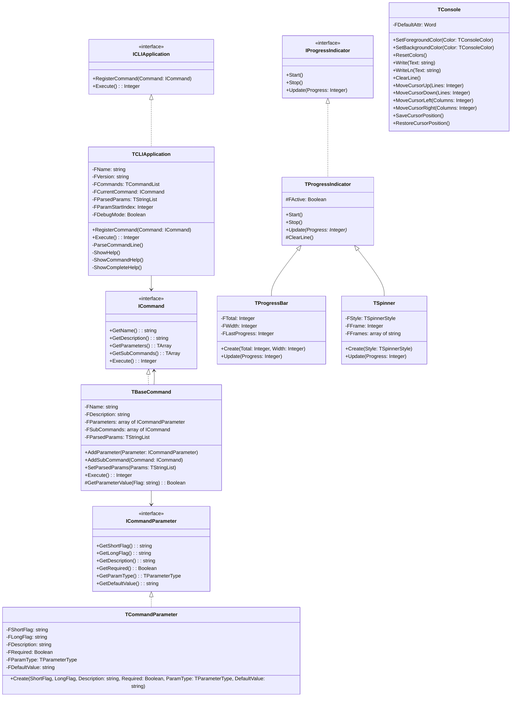

# CLI Framework Technical Documentation

## Architecture Overview

The Free Pascal CLI Framework is built on a modular, interface-based architecture that promotes extensibility and maintainability. The framework is organized into several key components that work together to provide a complete CLI solution.




## Core Components

### 1. Interfaces (`CLI.Interfaces`)

#### `ICommand`
```pascal
ICommand = interface
  function GetName: string;
  function GetDescription: string;
  function GetParameters: specialize TArray<ICommandParameter>;
  function GetSubCommands: specialize TArray<ICommand>;
  function Execute: Integer;
  property Name: string read GetName;
  property Description: string read GetDescription;
  property Parameters: specialize TArray<ICommandParameter> read GetParameters;
  property SubCommands: specialize TArray<ICommand> read GetSubCommands;
end;
```

#### `ICommandParameter`
```pascal
ICommandParameter = interface
  function GetShortFlag: string;
  function GetLongFlag: string;
  function GetDescription: string;
  function GetRequired: Boolean;
  function GetParamType: TParameterType;
  function GetDefaultValue: string;
  property ShortFlag: string read GetShortFlag;
  property LongFlag: string read GetLongFlag;
  property Description: string read GetDescription;
  property Required: Boolean read GetRequired;
  property ParamType: TParameterType read GetParamType;
  property DefaultValue: string read GetDefaultValue;
end;
```

#### `IProgressIndicator`
```pascal
IProgressIndicator = interface
  procedure Start;
  procedure Stop;
  procedure Update(const Progress: Integer); // 0-100 for percentage
end;
```

### 2. Application Core (`CLI.Application`)

The `TCLIApplication` class is the central component that:
- Manages command registration
- Handles command-line parsing
- Implements the help system
- Coordinates command execution

Key methods:
```pascal
TCLIApplication = class(TInterfacedObject, ICLIApplication)
private
  FName: string;
  FVersion: string;
  FCommands: TCommandList;
  FCurrentCommand: ICommand;
  FParsedParams: TStringList;
  FParamStartIndex: Integer;
  FDebugMode: Boolean;
public
  procedure RegisterCommand(const Command: ICommand);
  function Execute: Integer;
  property DebugMode: Boolean read FDebugMode write FDebugMode;
  property Version: string read FVersion;
  property Commands: TCommandList read GetCommands;
end;
```

### 3. Base Classes

#### `TBaseCommand` (`CLI.Command`)
Base implementation for commands with:
```pascal
TBaseCommand = class(TInterfacedObject, ICommand)
private
  FName: string;
  FDescription: string;
  FParameters: array of ICommandParameter;
  FSubCommands: array of ICommand;
  FParsedParams: TStringList;
protected
  function GetParameterValue(const Flag: string; out Value: string): Boolean;
public
  procedure AddParameter(const Parameter: ICommandParameter);
  procedure AddSubCommand(const Command: ICommand);
  procedure SetParsedParams(const Params: TStringList);
  function Execute: Integer; virtual; abstract;
end;
```

#### `TCommandParameter` (`CLI.Parameter`)
Base implementation for command parameters:
```pascal
TCommandParameter = class(TInterfacedObject, ICommandParameter)
private
  FShortFlag: string;
  FLongFlag: string;
  FDescription: string;
  FRequired: Boolean;
  FParamType: TParameterType;
  FDefaultValue: string;
public
  constructor Create(const AShortFlag, ALongFlag, ADescription: string;
    ARequired: Boolean; AParamType: TParameterType; const ADefaultValue: string = '');
end;
```

### 4. Console Support (`CLI.Console`)

Console color and cursor control:
```pascal
type
  TConsoleColor = (
    ccBlack, ccBlue, ccGreen, ccCyan, 
    ccRed, ccMagenta, ccYellow, ccWhite,
    ccBrightBlack, ccBrightBlue, ccBrightGreen, ccBrightCyan,
    ccBrightRed, ccBrightMagenta, ccBrightYellow, ccBrightWhite
  );

  TConsole = class
  private
    class var FDefaultAttr: Word;
    class procedure InitConsole;
  public
    class procedure SetForegroundColor(const Color: TConsoleColor);
    class procedure SetBackgroundColor(const Color: TConsoleColor);
    class procedure ResetColors;
    class procedure Write(const Text: string); overload;
    class procedure Write(const Text: string; const FgColor: TConsoleColor); overload;
    class procedure WriteLn(const Text: string); overload;
    class procedure WriteLn(const Text: string; const FgColor: TConsoleColor); overload;
    // Cursor control methods
    class procedure ClearLine;
    class procedure MoveCursorUp(const Lines: Integer = 1);
    class procedure MoveCursorDown(const Lines: Integer = 1);
    class procedure MoveCursorLeft(const Columns: Integer = 1);
    class procedure MoveCursorRight(const Columns: Integer = 1);
    class procedure SaveCursorPosition;
    class procedure RestoreCursorPosition;
  end;
```

### 5. Progress Indicators (`CLI.Progress`)

Two types of progress indicators:

#### Spinner
```pascal
type
  TSpinnerStyle = (
    ssDots,    // ⠋⠙⠹⠸⠼⠴⠦⠧⠇⠏
    ssLine,    // -\|/
    ssCircle   // ◐◓◑◒
  );

  TSpinner = class(TProgressIndicator)
  private
    FStyle: TSpinnerStyle;
    FFrame: Integer;
    FFrames: array of string;
  public
    constructor Create(const AStyle: TSpinnerStyle);
    procedure Update(const Progress: Integer); override;
  end;
```

#### Progress Bar
```pascal
TProgressBar = class(TProgressIndicator)
private
  FTotal: Integer;
  FWidth: Integer;
  FLastProgress: Integer;
public
  constructor Create(const ATotal: Integer; const AWidth: Integer = 10);
  procedure Update(const Progress: Integer); override;
end;
```

## Error Handling

The framework implements robust error handling through:

1. **Exception Classes** (`CLI.Errors`)
```pascal
type
  ECLIException = class(Exception);
  ECommandNotFoundException = class(ECLIException);
  EInvalidParameterException = class(ECLIException);
  ERequiredParameterMissingException = class(ECLIException);
  EInvalidParameterValueException = class(ECLIException);
  ECommandExecutionException = class(ECLIException);
```

2. **Parameter Validation**
- Required parameter checks
- Type validation
- Default value application

3. **Command Validation**
- Command existence checks
- Subcommand validation
- Parameter format validation

## Platform-Specific Considerations

### Windows Console Support
```pascal
{$IFDEF WINDOWS}
  // Uses Windows API for console manipulation
  Handle := GetStdHandle(STD_OUTPUT_HANDLE);
  GetConsoleScreenBufferInfo(Handle, Info);
  SetConsoleTextAttribute(Handle, Attributes);
{$ENDIF}
```

### Unix/Linux Console Support
```pascal
{$ELSE}
  // Uses ANSI escape sequences
  System.Write(#27'[<color_code>m');
{$ENDIF}
```

## Best Practices

1. **Command Implementation**
```pascal
type
  TMyCommand = class(TBaseCommand)
  public
    constructor Create;
    function Execute: Integer; override;
  end;
```

2. **Parameter Definition**
```pascal
Cmd.AddParameter(CreateParameter(
  '-p',
  '--param',
  'Parameter description',
  True,
  ptString,
  'default'
));
```

3. **Progress Indication**
```pascal
var
  Progress: IProgressIndicator;
begin
  Progress := CreateProgressBar(100, 20); // total=100, width=20
  Progress.Start;
  try
    // Update progress
    Progress.Update(50); // 50%
  finally
    Progress.Stop;
  end;
end;
```

4. **Color Usage**
- Use red for errors
- Use yellow for warnings
- Use green for success messages
- Use cyan for information
- Use white for normal output

5. **Error Handling**
```pascal
try
  Result := Command.Execute;
except
  on E: ECommandExecutionException do
  begin
    TConsole.WriteLn('Error: ' + E.Message, ccRed);
    Result := 1;
  end;
end;
```