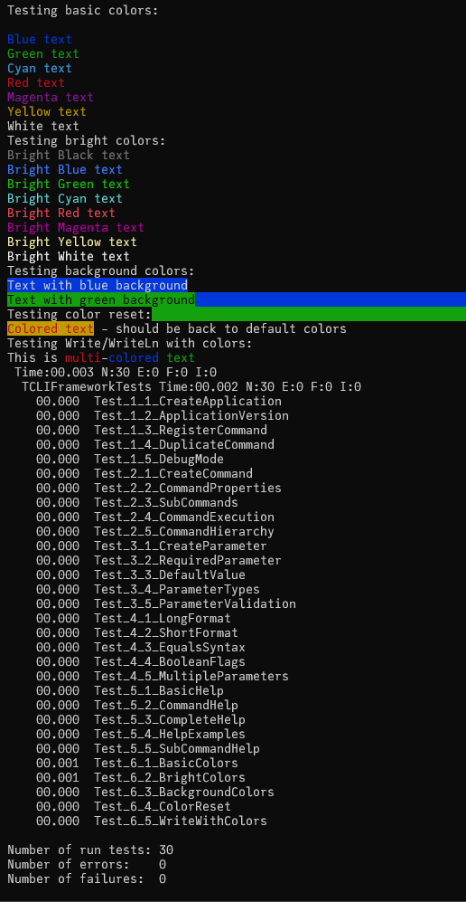

# Test Output

## 2024-12-21

```bash
$ TestRunner.exe -a --format=plain
Testing basic colors:
Black text
Blue text
Green text
Cyan text
Red text
Magenta text
Yellow text
White text
Testing bright colors:
Bright Black text
Bright Blue text
Bright Green text
Bright Cyan text
Bright Red text
Bright Magenta text
Bright Yellow text
Bright White text
Testing background colors:
Text with blue background
Text with green background
Testing color reset:
Colored text - should be back to default colors
Testing Write/WriteLn with colors:
This is multi-colored text
 Time:00.003 N:30 E:0 F:0 I:0
  TCLIFrameworkTests Time:00.002 N:30 E:0 F:0 I:0
    00.000  Test_1_1_CreateApplication
    00.000  Test_1_2_ApplicationVersion
    00.000  Test_1_3_RegisterCommand
    00.000  Test_1_4_DuplicateCommand
    00.000  Test_1_5_DebugMode
    00.000  Test_2_1_CreateCommand
    00.000  Test_2_2_CommandProperties
    00.000  Test_2_3_SubCommands
    00.000  Test_2_4_CommandExecution
    00.000  Test_2_5_CommandHierarchy
    00.000  Test_3_1_CreateParameter
    00.000  Test_3_2_RequiredParameter
    00.000  Test_3_3_DefaultValue
    00.000  Test_3_4_ParameterTypes
    00.000  Test_3_5_ParameterValidation
    00.000  Test_4_1_LongFormat
    00.000  Test_4_2_ShortFormat
    00.000  Test_4_3_EqualsSyntax
    00.000  Test_4_4_BooleanFlags
    00.000  Test_4_5_MultipleParameters
    00.000  Test_5_1_BasicHelp
    00.000  Test_5_2_CommandHelp
    00.000  Test_5_3_CompleteHelp
    00.000  Test_5_4_HelpExamples
    00.000  Test_5_5_SubCommandHelp
    00.001  Test_6_1_BasicColors
    00.001  Test_6_2_BrightColors
    00.000  Test_6_3_BackgroundColors
    00.000  Test_6_4_ColorReset
    00.000  Test_6_5_WriteWithColors

Number of run tests: 30
Number of errors:    0
Number of failures:  0


Heap dump by heaptrc unit of C:\Users\iwank\Documents\github\cli-fp\tests\TestRunner.exe
789 memory blocks allocated : 51257/53232
789 memory blocks freed     : 51257/53232
0 unfreed memory blocks : 0
True heap size : 229376 (256 used in System startup)
True free heap : 229120

$
```

