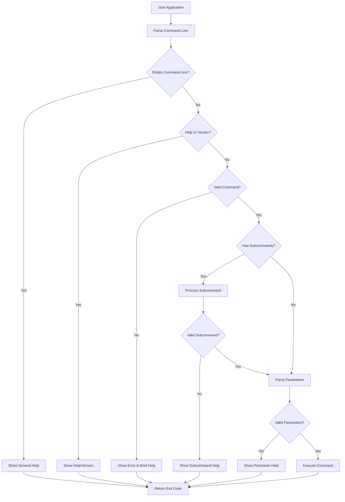
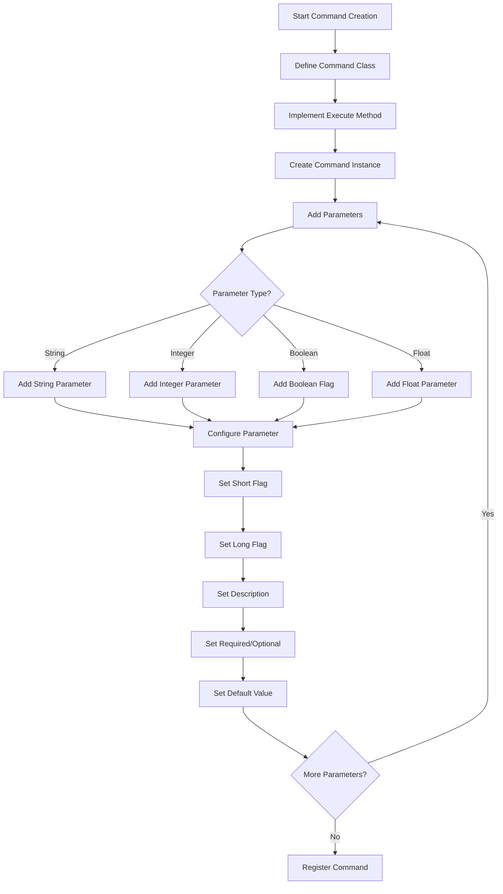

# CLI Framework User Manual

## Overview

The Free Pascal CLI Framework is a modern, feature-rich library for building command-line applications. It provides an intuitive way to create CLIs with commands, subcommands, parameters, and interactive progress indicators.


## Table of Contents

- [CLI Framework User Manual](#cli-framework-user-manual)
  - [Overview](#overview)
  - [Table of Contents](#table-of-contents)
  - [Features](#features)
  - [Application Flow](#application-flow)
  - [Command Parameter Building Flow](#command-parameter-building-flow)
  - [Installation](#installation)
  - [Quick Start](#quick-start)
    - [1. Creating a Simple CLI Application](#1-creating-a-simple-cli-application)
    - [2. Creating a Git-like CLI](#2-creating-a-git-like-cli)
    - [3. Progress Indicators](#3-progress-indicators)
      - [Spinner Types](#spinner-types)
      - [Using Spinners](#using-spinners)
      - [Progress Bars](#progress-bars)
      - [Choosing Between Spinner and Progress Bar](#choosing-between-spinner-and-progress-bar)
  - [Parameter Types and Validation](#parameter-types-and-validation)
    - [Basic Types](#basic-types)
      - [String Parameters](#string-parameters)
      - [Integer Parameters](#integer-parameters)
      - [Float Parameters](#float-parameters)
      - [Boolean Parameters and Flags](#boolean-parameters-and-flags)
      - [Date and Time Parameters](#date-and-time-parameters)
      - [Enumerated Values](#enumerated-values)
      - [URL Parameters](#url-parameters)
      - [Array Parameters](#array-parameters)
    - [Parameter Validation](#parameter-validation)
    - [Error Handling](#error-handling)
    - [Best Practices](#best-practices)
  - [Command-Line Usage](#command-line-usage)
    - [Basic Command Structure](#basic-command-structure)
    - [Getting Help](#getting-help)
    - [Parameter Formats](#parameter-formats)
  - [Troubleshooting](#troubleshooting)
    - [Common Issues](#common-issues)
  - [Best Practices](#best-practices-1)
  - [Useful Unicode Characters for CLI Interfaces](#useful-unicode-characters-for-cli-interfaces)
  - [Getting Help](#getting-help-1)
  - [Summary](#summary)


## Features

- Command and subcommand support
- Parameter handling with validation
- Progress indicators (spinner and progress bar)
- Colored console output
- Built-in help system
- Automatic usage examples generation

## Application Flow



## Command Parameter Building Flow



## Installation

1. Clone the repository:
   ```bash
   git clone https://github.com/your-repo/cli-fp.git
   ```

2. Add to your project:
   ```pascal
   uses
     CLI.Interfaces,
     CLI.Application,
     CLI.Command,
     CLI.Parameter,
     CLI.Progress,  // For progress indicators
     CLI.Console;   // For colored output
   ```

## Quick Start

### 1. Creating a Simple CLI Application

```pascal
program MyApp;

{$mode objfpc}{$H+}{$J-}

uses
  SysUtils,
  CLI.Interfaces,
  CLI.Application,
  CLI.Command,
  CLI.Parameter,
  CLI.Console;

type
  TGreetCommand = class(TBaseCommand)
  public
    function Execute: Integer; override;
  end;

function TGreetCommand.Execute: Integer;
var
  Name: string;
begin
  if GetParameterValue('--name', Name) then
    TConsole.WriteLn('Hello, ' + Name + '!')
  else
    TConsole.WriteLn('Hello, World!');
  Result := 0;
end;

var
  App: ICLIApplication;
  Cmd: TGreetCommand;
  ExitCode: Integer;
begin
  try
    App := CreateCLIApplication('MyApp', '1.0.0');
    
    Cmd := TGreetCommand.Create('greet', 'Greet a person');
    Cmd.AddParameter(
      '-n',
      '--name',
      'Name to greet',
      False,
      ptString
    ));
    
    App.RegisterCommand(Cmd);
    ExitCode := App.Execute;
  except
    on E: Exception do
    begin
      TConsole.WriteLn('Error: ' + E.Message, ccRed);
      ExitCode := 1;
    end;
  end;
  Halt(ExitCode);
end.
```

### 2. Creating a Git-like CLI

```pascal
type
  TCloneCommand = class(TBaseCommand)
  public
    function Execute: Integer; override;
  end;

  TInitCommand = class(TBaseCommand)
  public
    function Execute: Integer; override;
  end;

function TCloneCommand.Execute: Integer;
var
  Url: string;
  Progress: IProgressIndicator;
begin
  if not GetParameterValue('--url', Url) then
  begin
    TConsole.WriteLn('Error: URL is required', ccRed);
    Exit(1);
  end;

  Progress := CreateSpinner(ssLine);
  Progress.Start;
  try
    TConsole.WriteLn('Cloning from ' + Url + '...', ccCyan);
    Sleep(2000); // Simulate work
    TConsole.WriteLn('Clone complete!', ccGreen);
    Result := 0;
  finally
    Progress.Stop;
  end;
end;

function TInitCommand.Execute: Integer;
var
  Path: string;
  Progress: IProgressIndicator;
begin
  if not GetParameterValue('--path', Path) then
    Path := GetCurrentDir;

  Progress := CreateSpinner(ssLine);
  Progress.Start;
  try
    TConsole.WriteLn('Initializing repository at ' + Path + '...', ccCyan);
    Sleep(1000); // Simulate work
    TConsole.WriteLn('Repository initialized!', ccGreen);
    Result := 0;
  finally
    Progress.Stop;
  end;
end;

var
  App: ICLIApplication;
  RepoCmd: TBaseCommand;
  CloneCmd: TCloneCommand;
  InitCmd: TInitCommand;
  ExitCode: Integer;
begin
  try
    App := CreateCLIApplication('MyGit', '1.0.0');
    
    RepoCmd := TBaseCommand.Create('repo', 'Repository management');
    
    CloneCmd := TCloneCommand.Create('clone', 'Clone a repository');
    CloneCmd.AddParameter(
      '-u',
      '--url',
      'Repository URL to clone',
      True,     // Mark as required
      ptString
    ));
    RepoCmd.AddSubCommand(CloneCmd);
    
    InitCmd := TInitCommand.Create('init', 'Initialize a repository');
    InitCmd.AddParameter(
      '-p',
      '--path',
      'Path to initialize repository',
      False,    // Optional
      ptString,
      GetCurrentDir  // Default to current directory
    ));
    RepoCmd.AddSubCommand(InitCmd);
    
    App.RegisterCommand(RepoCmd);
    
    ExitCode := App.Execute;
  except
    on E: Exception do
    begin
      TConsole.WriteLn('Error: ' + E.Message, ccRed);
      ExitCode := 1;
    end;
  end;
  Halt(ExitCode);
end;
```

### 3. Progress Indicators

The framework provides two types of progress indicators: spinners for indeterminate progress (when you don't know the total steps) and progress bars for determinate progress (when you know the total steps).

#### Spinner Types

The framework supports various spinner styles to match your application's needs:

1. **Dots (ssDots)** - Braille dots animation
   ```
   ⠋⠙⠹⠸⠼⠴⠦⠧⠇⠏
   ```
   Best for: Modern terminals with Unicode support
   ```pascal
   Spinner := CreateSpinner(ssDots);
   ```

2. **Line (ssLine)** - Simple ASCII line animation
   ```
   -\|/
   ```
   Best for: Legacy terminals or when Unicode isn't supported
   ```pascal
   Spinner := CreateSpinner(ssLine);  // Default style
   ```

3. **Circle (ssCircle)** - Unicode circle animation
   ```
   ◐◓◑◒
   ```
   Best for: Clean, minimalist look
   ```pascal
   Spinner := CreateSpinner(ssCircle);
   ```

4. **Square (ssSquare)** - Square rotation animation
   ```
   ◰◳◲◱
   ```
   Best for: Alternative to circle style
   ```pascal
   Spinner := CreateSpinner(ssSquare);
   ```

5. **Arrow (ssArrow)** - Arrow rotation animation
   ```
   ←↖↑↗→↘↓↙
   ```
   Best for: Directional indication
   ```pascal
   Spinner := CreateSpinner(ssArrow);
   ```

6. **Bounce (ssBounce)** - Bouncing dot animation
   ```
   ⠁⠂⠄⠂
   ```
   Best for: Subtle indication
   ```pascal
   Spinner := CreateSpinner(ssBounce);
   ```

7. **Bar (ssBar)** - Wave block animation
   ```
   ▏▎▍▌▋▊▉█▊▋▌▍▎▏
   ```
   Best for: Smooth, wave-like animation that flows left to right
   ```pascal
   Spinner := CreateSpinner(ssBar);
   ```
   The animation creates a fluid motion by:
   - Starting thin on the left (▏)
   - Growing progressively thicker (▎▍▌▋▊▉)
   - Reaching full block (█)
   - Smoothly reducing thickness (▊▋▌▍▎▏)
   This creates a natural wave-like effect that's easy on the eyes.

#### Using Spinners

Here's a complete example of using a spinner:

```pascal
procedure ProcessFiles(const Files: TStringList);
var
  Spinner: IProgressIndicator;
  i: Integer;
begin
  // Create a spinner with dots style
  Spinner := CreateSpinner(ssDots);
  
  // Start the spinner
  Spinner.Start;
  try
    TConsole.WriteLn('Processing files...', ccCyan);
    
    // Your processing loop
    for i := 0 to Files.Count - 1 do
    begin
      // Update spinner (will animate)
      Spinner.Update(0);  // The parameter is ignored for spinners
      
      // Do your work here
      ProcessFile(Files[i]);
      Sleep(100);  // Simulate work
    end;
    
    TConsole.WriteLn('Processing complete!', ccGreen);
  finally
    // Always stop the spinner in a finally block
    Spinner.Stop;
  end;
end;
```

Important notes for using spinners:
- Always use a try-finally block to ensure the spinner is stopped
- Call Update regularly to maintain animation
- Choose a style appropriate for your terminal's capabilities
- The Update parameter is ignored for spinners (used for interface compatibility)

#### Progress Bars

For operations where you know the total steps, use a progress bar:

```pascal
procedure CopyFiles(const Files: TStringList);
var
  Progress: IProgressIndicator;
  i: Integer;
begin
  // Create a progress bar (total steps, width in characters)
  Progress := CreateProgressBar(Files.Count, 20);
  
  // Start the progress bar
  Progress.Start;
  try
    TConsole.WriteLn('Copying files...', ccCyan);
    
    // Your processing loop
    for i := 0 to Files.Count - 1 do
    begin
      // Update progress (current step)
      Progress.Update(i + 1);
      
      // Do your work here
      CopyFile(Files[i], DestPath + ExtractFileName(Files[i]));
      Sleep(50);  // Simulate work
    end;
    
    TConsole.WriteLn('Copy complete!', ccGreen);
  finally
    // Always stop the progress bar in a finally block
    Progress.Stop;
  end;
end;
```

Progress bar features:
- Shows percentage complete
- Visual bar indicates progress
- Automatically updates only when percentage changes
- Width is customizable

#### Choosing Between Spinner and Progress Bar

Use a **Spinner** when:
- The operation has no measurable progress
- You can't determine the total steps
- The operation is relatively quick
- You want to show activity without specifics

Use a **Progress Bar** when:
- You know the total number of steps
- The operation has measurable progress
- You want to show specific completion percentage
- The user needs to know how much longer to wait

## Parameter Types and Validation

The framework provides a rich set of parameter types with built-in validation:

### Basic Types

#### String Parameters
```pascal
// Any text value
AddStringParameter('-n', '--name', 'Name parameter');
```

#### Integer Parameters
```pascal
// Must be a valid integer
AddIntegerParameter('-c', '--count', 'Count parameter', True);  // Required
```

#### Float Parameters
```pascal
// Must be a valid floating-point number
AddFloatParameter('-r', '--rate', 'Rate parameter');
```

#### Boolean Parameters and Flags
```pascal
// Flag: Presence indicates true
AddFlag('-v', '--verbose', 'Enable verbose mode');

// Boolean: Must be 'true' or 'false'
AddBooleanParameter('-d', '--debug', 'Debug mode', False, 'false');
```

#### Date and Time Parameters
```pascal
// Must be in format "YYYY-MM-DD HH:MM" (24-hour format)
AddDateTimeParameter('-d', '--date', 'Date parameter');
```

#### Enumerated Values
```pascal
// Must match one of the pipe-separated values
AddEnumParameter('-l', '--level', 'Log level', 'debug|info|warn|error');
```

#### URL Parameters
```pascal
// Must start with http://, https://, git://, or ssh://
AddUrlParameter('-u', '--url', 'Repository URL');
```

#### Array Parameters
```pascal
// Comma-separated values
AddArrayParameter('-t', '--tags', 'Tag list');
```

### Parameter Validation

All parameters are validated before the command's Execute method is called. If validation fails, an error message is displayed and the command is not executed.

Example error messages:
- Integer: "Parameter '--count' must be an integer"
- Float: "Parameter '--rate' must be a float"
- Boolean: "Parameter '--debug' must be 'true' or 'false'"
- DateTime: "Parameter '--date' must be in format YYYY-MM-DD HH:MM"
- URL: "Parameter '--url' must be a valid URL starting with http://, https://, git://, or ssh://"
- Enum: "Parameter '--level' must be one of: debug|info|warn|error"

### Error Handling

The framework provides clear error messages for validation failures:

```pascal
try
  // Your command execution code
except
  on E: EInvalidParameterValueException do
    WriteLn('Invalid parameter value: ', E.Message);
  on E: ERequiredParameterMissingException do
    WriteLn('Missing required parameter: ', E.Message);
end;
```

### Best Practices

1. **Use Descriptive Names**
   ```pascal
   // Good
   Cmd.AddStringParameter('-n', '--name', 'User name');
   
   // Not as clear
   Cmd.AddStringParameter('-x', '--x', 'Name');
   ```

2. **Provide Helpful Descriptions**
   ```pascal
   // Good
   Cmd.AddIntegerParameter('-c', '--count', 'Number of items to process (1-100)');
   
   // Too vague
   Cmd.AddIntegerParameter('-c', '--count', 'Count');
   ```

3. **Use Appropriate Types**
   ```pascal
   // Good
   Cmd.AddUrlParameter('-u', '--url', 'Repository URL');
   
   // Not as good
   Cmd.AddStringParameter('-u', '--url', 'Repository URL');
   ```

4. **Set Sensible Defaults**
   ```pascal
   // Good
   Cmd.AddIntegerParameter('-l', '--limit', 'Result limit', False, '10');
   
   // May surprise users
   Cmd.AddIntegerParameter('-l', '--limit', 'Result limit', False, '999999');
   ```

5. **Group Related Parameters**
   ```pascal
   // Input/Output parameters
   Cmd.AddPathParameter('-i', '--input', 'Input file');
   Cmd.AddPathParameter('-o', '--output', 'Output file');
   
   // Configuration parameters
   Cmd.AddEnumParameter('-l', '--log-level', 'Log level', 'debug|info|warn');
   Cmd.AddFlag('-v', '--verbose', 'Enable verbose output');
   ```

## Command-Line Usage

### Basic Command Structure

```bash
myapp <command> [options]
```

### Getting Help

- Show general help: `myapp -h` or `myapp --help`
- Show detailed reference: `myapp --help-complete`
- Show command help: `myapp <command> --help`

### Parameter Formats

The framework supports various parameter formats:
- Long format: `--param=value` or `--param value`
- Short format: `-p value`
- Boolean flags: `--flag` or `-f`

## Troubleshooting

### Common Issues

1. **Command Not Found**
   - Verify command name spelling
   - Check if command is properly registered with `App.RegisterCommand`
   - Enable debug mode:
     ```pascal
     (App as TCLIApplication).DebugMode := True;
     ```

2. **Parameter Errors**
   - Check parameter format:
     ```bash
     --param=value    # Equals syntax
     --param value    # Space syntax
     -p value        # Short format
     ```
   - Verify required parameters are provided
   - Check parameter type matches expected value
   - Use `GetParameterValue` correctly:
     ```pascal
     var
       Value: string;
     begin
       if GetParameterValue('--param', Value) then
         // Parameter was provided
       else
         // Parameter was not provided
     end;
     ```

3. **Console Colors Not Working**
   - Windows: Check if ANSI support is enabled
   - Unix/Linux: Verify terminal supports colors
   - Always reset colors:
     ```pascal
     TConsole.SetForegroundColor(ccRed);
     try
       // Your colored output
     finally
       TConsole.ResetColors;
     end;
     ```

## Best Practices

1. **Command Organization**
   - Group related functionality into commands
   - Use subcommands for complex features
   - Keep command names clear and consistent
   - Follow naming conventions

2. **User Experience**
   - Provide helpful descriptions
   - Include examples in help text
   - Use progress indicators for long operations
   - Provide feedback for all operations

3. **Error Handling**
   - Display clear error messages using appropriate colors
   - Use appropriate exit codes
   - Validate user input
   - Always handle exceptions

4. **Color Usage**
   - Use red for errors
   - Use yellow for warnings
   - Use green for success messages
   - Use cyan for information
   - Use white for normal output

5. **Progress Indication**
   - Use spinners for indeterminate progress
   - Use progress bars for determinate progress
   - Always stop indicators in a finally block
   - Provide status messages with progress

## Useful Unicode Characters for CLI Interfaces

```
// Status indicators
'✓' // Success/Done
'✘' // Error/Failed
'⚠' // Warning
'ℹ' // Info
'❯' // Current item/Selection
'►' // Action/Process
'•' // Bullet point
'○' // Empty bullet
'●' // Filled bullet

// Progress/Loading
'⠋⠙⠹⠸⠼⠴⠦⠧⠇⠏' // Braille dots animation
'◐◓◑◒' // Circle animation
'▏▎▍▌▋▊▉█' // Progress bar blocks

// Borders/Boxes
'╔═╗' // Top border
'║ ║' // Side borders
'╚═╝' // Bottom border
```


## Getting Help

- Use `--help-complete` for comprehensive documentation
- Check command-specific help with `<command> --help`
- Enable debug mode for troubleshooting
- Refer to the technical documentation for development details

## Summary

This manual has walked you through building and extending CLI applications using the Free Pascal CLI Framework. By following these guidelines and best practices, you can create robust and user-friendly command-line tools.
Happy Coding!