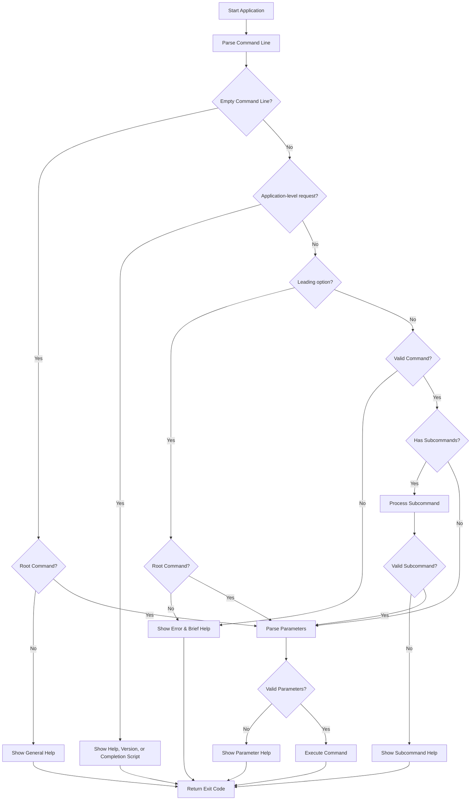
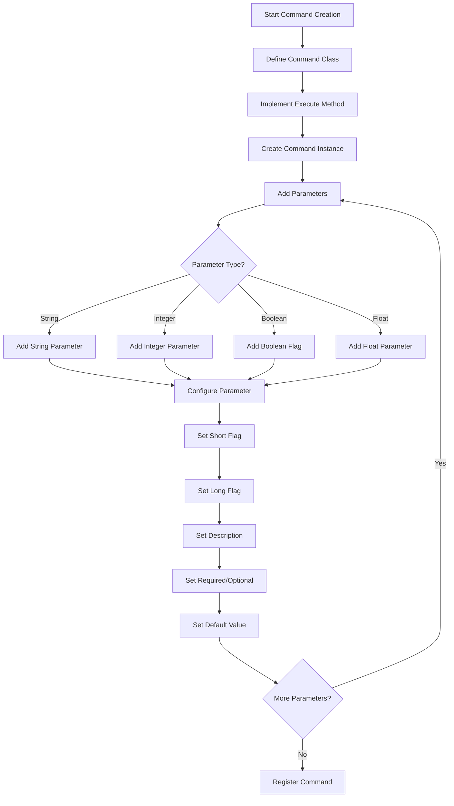

# CLI Framework User Manual

[Documentation home](README.md) · [Project README](../README.md) ·
[Code generator](codegen.md) · [API reference](api-reference.md)

## Overview

`cli-fp` is an Object Pascal library for native command-line applications. It
provides root commands, named commands and subcommands, typed parameter
metadata, generated help, shell completion, coloured output, and progress
indicators.

This guide starts with complete programs and then explains individual
features. For the shortest first success, generate and compile the
[README tutorial project](../README.md#build-your-first-generated-cli) before
returning here.

## Before You Begin

The project is tested with Free Pascal 3.2.2. Confirm that the compiler is on
your command path:

```text
fpc -iV
```

When a command in this guide contains `-Fu../cli-fp/src`, adjust the path so it
points to this repository's `src` directory. `-Fu` adds a unit-search path;
units named in a Pascal `uses` clause are found there.

If `.lpr`, `.pas`, `uses`, or `{$mode objfpc}` are new to you, read
[Free Pascal in two minutes](../README.md#free-pascal-in-two-minutes).

## Choose a Learning Path

| Goal | Start here |
| --- | --- |
| Build a conventional CLI with named commands | [Simple application](#1-creating-a-simple-cli-application) |
| Build a focused tool invoked as `app [options]` | [Root-command application](#2-creating-a-root-command-application) |
| Build `git`-style nested commands | [Git-like CLI](#3-creating-a-git-like-cli) |
| Add spinners or progress bars | [Progress indicators](#4-progress-indicators) |
| Look up registration calls quickly | [API cheat sheet](#api-cheat-sheet) |
| Generate the project structure | [Code-generator guide](codegen.md) |

## Table of Contents

- [Features](#features)
- [How an application executes](#application-flow)
- [Installation](#installation)
- [Quick Start](#quick-start)
- [Parameter types and validation](#parameter-types-and-validation)
- [Command-line usage](#command-line-usage)
- [Troubleshooting](#troubleshooting)
- [Best practices](#best-practices)
- [API cheat sheet](#api-cheat-sheet)
- [Bash completion](#bash-completion)
- [PowerShell tab completion](#powershell-tab-completion)
- [Where to go next](#where-to-go-next)

## Features

- Command and subcommand support
- Optional root commands for applications with a default action
- Parameter handling with validation
- Progress indicators (spinner and progress bar)
- Colored console output
- Built-in help system
- Automatic usage examples generation

## Application Flow


```mermaid
flowchart TD
    A[Start Application] --> B[Parse Command Line]
    B --> C{Empty Command Line?}
    C -->|Yes| D{Root Command?}
    D -->|No| R[Show General Help]
    D -->|Yes| M
    C -->|No| E{Application-level request?}
    E -->|Yes| F[Show Help, Version, or Completion Script]
    E -->|No| G{Leading option?}
    G -->|Yes| S{Root Command?}
    S -->|No| H[Show Error & Brief Help]
    S -->|Yes| M
    G -->|No| T{Valid Command?}
    T -->|No| H
    T -->|Yes| I{Has Subcommands?}
    I -->|Yes| J[Process Subcommand]
    J --> K{Valid Subcommand?}
    K -->|No| L[Show Subcommand Help]
    K -->|Yes| M[Parse Parameters]
    I -->|No| M
    M --> N{Valid Parameters?}
    N -->|No| O[Show Parameter Help]
    N -->|Yes| P[Execute Command]
    P --> Q[Return Exit Code]
    R --> Q
    F --> Q
    H --> Q
    L --> Q
    O --> Q
```

## Command Parameter Building Flow


```mermaid
flowchart TD
    A[Start Command Creation] --> B[Define Command Class]
    B --> C[Implement Execute Method]
    C --> D[Create Command Instance]
    D --> E[Add Parameters]
    E --> F{Parameter Type?}
    F -->|String| G[Add String Parameter]
    F -->|Integer| H[Add Integer Parameter]
    F -->|Boolean| I[Add Boolean Flag]
    F -->|Float| J[Add Float Parameter]
    G --> K[Configure Parameter]
    H --> K
    I --> K
    J --> K
    K --> L[Set Short Flag]
    L --> M[Set Long Flag]
    M --> N[Set Description]
    N --> O[Set Required/Optional]
    O --> P[Set Default Value]
    P --> Q{More Parameters?}
    Q -->|Yes| E
    Q -->|No| R[Register Command]
```

## Installation

1. Clone the repository:
   ```bash
   git clone https://github.com/ikelaiah/cli-fp.git
   ```

2. Add to your project:
   ```pascal
   uses
     CLI.Interfaces,
     CLI.Application,
     CLI.Command,
     CLI.Parameter,
     CLI.Progress,  // For progress indicators
     CLI.Console;   // For colored output
   ```

## Quick Start

### 1. Creating a Simple CLI Application

```pascal
program MyApp;

{$mode objfpc}{$H+}{$J-}

uses
  SysUtils,
  CLI.Interfaces,
  CLI.Application,
  CLI.Command,
  CLI.Parameter,
  CLI.Console;

type
  TGreetCommand = class(TBaseCommand)
  public
    function Execute: Integer; override;
  end;

function TGreetCommand.Execute: Integer;
var
  PersonName: string;
begin
  if GetParameterValue('--name', PersonName) then
    TConsole.WriteLn('Hello, ' + PersonName + '!')
  else
    TConsole.WriteLn('Hello, World!');
  Result := 0;
end;

var
  App: ICLIApplication;
  Cmd: TGreetCommand;
  ExitCode: Integer;
begin
  try
    App := CreateCLIApplication('MyApp', '1.0.0');
    
    Cmd := TGreetCommand.Create('greet', 'Greet a person');
    // Add a string parameter for the name. It's optional.
    // If not provided and no default is set here, 'Hello, World!' will be printed by the Execute logic.
    Cmd.AddStringParameter('-n', '--name', 'Name to greet', False);
    // The above is a shorthand for:
    // Cmd.AddParameter('-n', '--name', 'Name to greet', False, ptString, '');
    
    App.RegisterCommand(Cmd);
    ExitCode := App.Execute;
  except
    on E: Exception do
    begin
      TConsole.WriteLn('Error: ' + E.Message, ccRed);
      ExitCode := 1;
    end;
  end;
  Halt(ExitCode);
end.
```

### 2. Creating a Root-Command Application

An optional root command runs as the executable's default action. It uses the
same `TBaseCommand` parameter and validation APIs as named commands, but its
name is not typed on the command line:

```pascal
type
  TGreetRootCommand = class(TBaseCommand)
  public
    function Execute: Integer; override;
  end;

function TGreetRootCommand.Execute: Integer;
var
  PersonName: string;
begin
  if not GetParameterValue('--name', PersonName) then
    PersonName := 'World';
  WriteLn('Hello, ', PersonName, '!');
  Result := 0;
end;

var
  App: ICLIApplication;
  RootCommand: TGreetRootCommand;
begin
  RootCommand := TGreetRootCommand.Create('', 'Greet someone');
  RootCommand.AddStringParameter('-n', '--name', 'Name to greet',
    False, 'World');

  App := CreateCLIApplication('MyApp', '1.0.0', RootCommand);
  Halt(App.Execute);
end.
```

Usage:

```text
MyApp
MyApp --name Gus
```

Root commands are opt-in. The existing two-argument factory continues to show
general help for an empty command line. A root command may coexist with
commands registered through `RegisterCommand`; a leading command name selects
the named command, while a leading option selects the root command.

Root parameters are not inherited by named commands, and positional arguments
are not currently supported. Sole help/version requests and first-argument
completion-script requests are dispatched at application level before root
execution.

### 3. Creating a Git-like CLI

```pascal
type
  TRepoCommand = class(TBaseCommand)
  public
    function Execute: Integer; override;
  end;

  TCloneCommand = class(TBaseCommand)
  public
    function Execute: Integer; override;
  end;

  TInitCommand = class(TBaseCommand)
  public
    function Execute: Integer; override;
  end;

function TRepoCommand.Execute: Integer;
begin
  // The application displays command help when no subcommand is selected.
  Result := 0;
end;

function TCloneCommand.Execute: Integer;
var
  Url: string;
  Progress: IProgressIndicator;
begin
  if not GetParameterValue('--url', Url) then
  begin
    TConsole.WriteLn('Error: URL is required', ccRed);
    Exit(1);
  end;

  Progress := CreateSpinner(ssLine);
  Progress.Start;
  try
    TConsole.WriteLn('Cloning from ' + Url + '...', ccCyan);
    Sleep(2000); // Simulate work
    TConsole.WriteLn('Clone complete!', ccGreen);
    Result := 0;
  finally
    Progress.Stop;
  end;
end;

function TInitCommand.Execute: Integer;
var
  Path: string;
  Progress: IProgressIndicator;
begin
  if not GetParameterValue('--path', Path) then
    Path := GetCurrentDir;

  Progress := CreateSpinner(ssLine);
  Progress.Start;
  try
    TConsole.WriteLn('Initializing repository at ' + Path + '...', ccCyan);
    Sleep(1000); // Simulate work
    TConsole.WriteLn('Repository initialized!', ccGreen);
    Result := 0;
  finally
    Progress.Stop;
  end;
end;

var
  App: ICLIApplication;
  RepoCmd: TRepoCommand;
  CloneCmd: TCloneCommand;
  InitCmd: TInitCommand;
  ExitCode: Integer;
begin
  try
    App := CreateCLIApplication('MyGit', '1.0.0');
    
    RepoCmd := TRepoCommand.Create('repo', 'Repository management');
    
    CloneCmd := TCloneCommand.Create('clone', 'Clone a repository');
    // Add a required string parameter for the URL.
    CloneCmd.AddStringParameter('-u', '--url', 'Repository URL to clone', True);
    // The above is a shorthand for:
    // CloneCmd.AddParameter('-u', '--url', 'Repository URL to clone', True, ptString, '');
    RepoCmd.AddSubCommand(CloneCmd);
    
    InitCmd := TInitCommand.Create('init', 'Initialize a repository');
    // Add an optional path parameter, defaulting to the current directory.
    InitCmd.AddPathParameter('-p', '--path', 'Path to initialize repository', False, GetCurrentDir);
    // The above is a shorthand for:
    // InitCmd.AddParameter('-p', '--path', 'Path to initialize repository', False, ptPath, GetCurrentDir);
    RepoCmd.AddSubCommand(InitCmd);
    
    App.RegisterCommand(RepoCmd);
    
    ExitCode := App.Execute;
  except
    on E: Exception do
    begin
      TConsole.WriteLn('Error: ' + E.Message, ccRed);
      ExitCode := 1;
    end;
  end;
  Halt(ExitCode);
end;
```

### 4. Progress Indicators

The framework provides two types of progress indicators: spinners for indeterminate progress (when you don't know the total steps) and progress bars for determinate progress (when you know the total steps). Both support optional inline status text via `Update(Progress, Caption)`.

#### Spinner Types

The framework supports various spinner styles to match your application's needs:

1. **Dots (ssDots)** - Braille dots animation
   ```
   ⠋⠙⠹⠸⠼⠴⠦⠧⠇⠏
   ```
   Best for: Modern terminals with Unicode support
   ```pascal
   Spinner := CreateSpinner(ssDots);
   ```

2. **Line (ssLine)** - Simple ASCII line animation
   ```
   -\|/
   ```
   Best for: Legacy terminals or when Unicode isn't supported
   ```pascal
   Spinner := CreateSpinner(ssLine);  // Default style
   ```

3. **Circle (ssCircle)** - Unicode circle animation
   ```
   ◐◓◑◒
   ```
   Best for: Clean, minimalist look
   ```pascal
   Spinner := CreateSpinner(ssCircle);
   ```

4. **Square (ssSquare)** - Square rotation animation
   ```
   ◰◳◲◱
   ```
   Best for: Alternative to circle style
   ```pascal
   Spinner := CreateSpinner(ssSquare);
   ```

5. **Arrow (ssArrow)** - Arrow rotation animation
   ```
   ←↖↑↗→↘↓↙
   ```
   Best for: Directional indication
   ```pascal
   Spinner := CreateSpinner(ssArrow);
   ```

6. **Bounce (ssBounce)** - Bouncing dot animation
   ```
   ⠁⠂⠄⠂
   ```
   Best for: Subtle indication
   ```pascal
   Spinner := CreateSpinner(ssBounce);
   ```

7. **Bar (ssBar)** - Wave block animation
   ```
   ▏▎▍▌▋▊▉█▊▋▌▍▎▏
   ```
   Best for: Smooth, wave-like animation that flows left to right
   ```pascal
   Spinner := CreateSpinner(ssBar);
   ```
   The animation creates a fluid motion by:
   - Starting thin on the left (▏)
   - Growing progressively thicker (▎▍▌▋▊▉)
   - Reaching full block (█)
   - Smoothly reducing thickness (▊▋▌▍▎▏)
   This creates a natural wave-like effect that's easy on the eyes.

#### Using Spinners

Here's a complete example of using a spinner:

```pascal
procedure ProcessFiles(const Files: TStringList);
var
  Spinner: IProgressIndicator;
  i: Integer;
begin
  // Create a spinner with dots style
  Spinner := CreateSpinner(ssDots);
  
  // Start the spinner
  Spinner.Start;
  try
    TConsole.WriteLn('Processing files...', ccCyan);
    
    // Your processing loop
    for i := 0 to Files.Count - 1 do
    begin
      // Update spinner (will animate)
      Spinner.Update(0, 'Loading...');  // Progress value is ignored for spinners
      
      // Do your work here
      ProcessFile(Files[i]);
      Sleep(100);  // Simulate work
    end;
    
    TConsole.WriteLn('Processing complete!', ccGreen);
  finally
    // Always stop the spinner in a finally block
    Spinner.Stop;
  end;
end;
```

Important notes for using spinners:
- Always use a try-finally block to ensure the spinner is stopped
- Call Update regularly to maintain animation
- Choose a style appropriate for your terminal's capabilities
- The Update parameter is ignored for spinners (used for interface compatibility)

#### Progress Bars

For operations where you know the total steps, use a progress bar:

```pascal
procedure CopyFiles(const Files: TStringList);
var
  Progress: IProgressIndicator;
  i: Integer;
begin
  // Create a progress bar (total steps, width in characters)
  Progress := CreateProgressBar(Files.Count, 20);
  
  // Start the progress bar
  Progress.Start;
  try
    TConsole.WriteLn('Copying files...', ccCyan);
    
    // Your processing loop
    for i := 0 to Files.Count - 1 do
    begin
      // Update progress (current step)
      Progress.Update(i + 1, Format('File %d/%d', [i + 1, Files.Count]));
      
      // Do your work here
      CopyFile(Files[i], DestPath + ExtractFileName(Files[i]));
      Sleep(50);  // Simulate work
    end;
    
    TConsole.WriteLn('Copy complete!', ccGreen);
  finally
    // Always stop the progress bar in a finally block
    Progress.Stop;
  end;
end;
```

Progress bar features:
- Shows percentage complete
- Visual bar indicates progress
- Automatically updates only when percentage changes
- Width is customizable

#### Choosing Between Spinner and Progress Bar

Use a **Spinner** when:
- The operation has no measurable progress
- You can't determine the total steps
- The operation is relatively quick
- You want to show activity without specifics

Use a **Progress Bar** when:
- You know the total number of steps
- The operation has measurable progress
- You want to show specific completion percentage
- The user needs to know how much longer to wait

## Parameter Types and Validation

The framework provides a rich set of parameter types with built-in validation:

### Registration Methods by Type

#### String Parameters
```pascal
// Any text value
AddStringParameter('-n', '--name', 'Name parameter');
```

#### Integer Parameters
```pascal
// Must be a valid integer
AddIntegerParameter('-c', '--count', 'Count parameter', True);  // Required
```

#### Float Parameters
```pascal
// Must be a valid floating-point number
AddFloatParameter('-r', '--rate', 'Rate parameter');
```

#### Boolean Parameters and Flags
```pascal
// Flag: Presence indicates true, false by default
AddFlag('-v', '--verbose', 'Enable verbose mode');

// Boolean: Must be 'true' or 'false'
AddBooleanParameter('-d', '--debug', 'Debug mode', False, 'false');
```

> **Note:** `AddFlag` uses the default string `'false'` unless you override it.
> Presence without an explicit value produces `'true'`. A custom default of
> `'true'` therefore makes an absent flag true, which is usually surprising.

#### Date and Time Parameters
```pascal
// Recommended portable format: "YYYY-MM-DD HH:MM"
AddDateTimeParameter('-d', '--date', 'Date parameter');
```

#### Enumerated Values
```pascal
// Must match one of the pipe-separated values
AddEnumParameter('-l', '--level', 'Log level', 'debug|info|warn|error');
```

#### URL Parameters
```pascal
// Must start with http://, https://, git://, or ssh://
AddUrlParameter('-u', '--url', 'Repository URL');
```

#### Array Parameters
```pascal
// Comma-separated values
AddArrayParameter('-t', '--tags', 'Tag list');
```

#### Password Parameters
```pascal
// Treat the retrieved value as sensitive
AddPasswordParameter('-k', '--api-key', 'API Key');
```

Password parameters are returned to command code as ordinary strings. The
framework redacts them from its own `DebugMode` diagnostics, but it does not
redact values written by your application or external logging.

### Parameter Validation

The framework validates all parameters before executing a command. Each parameter type has specific validation rules:

### Validation Rules by Type
- **String**: No validation
- **Integer**: Must be a valid integer number
- **Float**: Must be a valid floating-point number
- **Boolean**: Must be 'true' or 'false' (case-insensitive)

### Complex Types
- **DateTime**: Uses `TryStrToDateTime` with `yyyy-mm-dd` date settings.
  `YYYY-MM-DD HH:MM` is the recommended portable form, but the current parser
  may also accept date-only values or seconds.
- **Enum**: Must match one of the pipe-separated allowed values
- **URL**: Must start with http://, https://, git://, or ssh://
- **Array**: No validation on individual items
- **Password**: No validation; framework debug diagnostics are redacted, but
  application and external logging output is not

### Error Messages

The framework provides clear error messages when validation fails:

```
Error: Parameter "--count" must be an integer
Error: Parameter "--rate" must be a float
Error: Parameter "--debug" must be "true" or "false"
Error: Parameter "--date" must be in format YYYY-MM-DD HH:MM
Error: Parameter "--url" must be a valid URL starting with http://, https://, git://, or ssh://
Error: Parameter "--level" must be one of: debug|info|warn|error
```

### Required Parameters

Parameters can be marked as required:
```pascal
// Required parameter
AddIntegerParameter('-c', '--count', 'Count parameter', True);

// Optional parameter with default
AddStringParameter('-n', '--name', 'Name parameter', False, 'default');
```

If a required parameter is missing, the command will not execute and an error message will be displayed:
```
Error: Required parameter "--count" not provided
```

### Default Values

Optional parameters can have default values:
```pascal
// String with default
AddStringParameter('-n', '--name', 'Name parameter', False, 'World');

// Float with default
AddFloatParameter('-r', '--rate', 'Rate parameter', False, '1.0');

// Enum with default
AddEnumParameter('-l', '--level', 'Log level', 'debug|info|warn|error', False, 'info');
```

The default value will be used when:
- The parameter is not provided on the command line
- A default value is specified

A non-empty default also satisfies the current required-parameter check.
Avoid combining `Required = True` with a default when you need to distinguish
user input from fallback configuration.

### Getting Parameter Values

To retrieve parameter values in your command's Execute method:

```pascal
function TMyCommand.Execute: Integer;
var
  PersonName, CountStr, RateStr, Level: string;
  Count: Integer;
  Rate: Double;
begin
  // Get parameter values with error checking
  if GetParameterValue('--name', PersonName) then
    WriteLn('Name: ', PersonName);

  if GetParameterValue('--count', CountStr) and TryStrToInt(CountStr, Count) then
    WriteLn('Count: ', Count);

  if GetParameterValue('--rate', RateStr) and TryStrToFloat(RateStr, Rate) then
    WriteLn('Rate: ', Rate:0:2);

  if GetParameterValue('--level', Level) then
    WriteLn('Level: ', Level);
    
  Result := 0;
end;
```

### Parameter Best Practices

1. **Check the Retrieved Boolean Text**: `GetParameterValue` returns `True`
   when a value or non-empty default exists. Standard flags have the default
   string `'false'`, so an absent flag normally still returns `True`. Use
   `SameText(Value, 'true')` to determine its value; the return value does not
   tell you whether the user explicitly typed the flag.

2. **Convert Retrieved Strings Explicitly**: `GetParameterValue` returns strings, so use `SysUtils` helpers after reading the value:
   ```pascal
   var
      CountValue, RateValue, EnabledValue: string;
      Count: Integer;
      Rate: Double;
      IsEnabled: Boolean;

    GetParameterValue('--count', CountValue);
    TryStrToInt(CountValue, Count);

    GetParameterValue('--rate', RateValue);
    TryStrToFloat(RateValue, Rate);

    GetParameterValue('--enabled', EnabledValue);
    IsEnabled := SameText(EnabledValue, 'true');
   ```

3. **Provide Clear Descriptions**: Parameter descriptions appear in help text:
   ```pascal
   AddStringParameter('-n', '--name', 'Your name (required for personalized greeting)');
   ```

4. **Use Appropriate Types**: Choose the most appropriate parameter type:
   - Use `AddFlag` for simple on/off features
   - Use `AddBooleanParameter` for explicit true/false values
   - Use `AddEnumParameter` for fixed sets of values
   - Use `AddPasswordParameter` for sensitive data

## Command-Line Usage

### Basic Command Structure

```bash
myapp <command> [options]
myapp [root-options]          # when a root command is configured
```

### Getting Help

- Used alone, `myapp -h` or `myapp --help` shows general application help.
- `myapp --help-complete` shows the complete command reference.
- `myapp <command> --help` shows help for the selected command level.
- Used alone, `myapp -v` or `myapp --version` prints application version
  information.

### Parameter Formats

The framework supports various parameter formats:
- Long format: `--param=value` or `--param value`
- Short format: `-p value`
- Boolean flags: `--flag` or `-f` (false by default, true when present)

Registered integer and float options accept negative values in either long
form: `--count=-1` and `--count -1` are equivalent. For values of other types
that begin with `-`, use the equals form so the parser does not treat the value
as another option.

Example:
```bash
myapp test --flag        # --flag is true
myapp test               # --flag is false
```

## Troubleshooting

### Common Issues

1. **Command Not Found**
   - Verify command name spelling
   - Check if command is properly registered with `App.RegisterCommand`
   - When diagnosing dispatch, construct the concrete application class and
     enable its debug output before execution:
     ```pascal
     Application := TCLIApplication.Create('MyApp', '1.0.0');
     Application.DebugMode := True;
     ```
     `DebugMode` is a `TCLIApplication` property and is not exposed by the
     `ICLIApplication` returned from the factory. Manage the concrete
     instance's lifetime normally. Values belonging to parameters registered
     with `AddPasswordParameter` are shown as `[REDACTED]`.

2. **Parameter Errors**
   - Check parameter format:
     ```bash
     --param=value    # Equals syntax
     --param value    # Space syntax
     -p value        # Short format
     ```
   - Verify required parameters are provided
   - Check parameter type matches expected value
   - Use `GetParameterValue` correctly:
     ```pascal
     var
       Value: string;
     begin
       if GetParameterValue('--param', Value) then
         // A provided value or non-empty default is available
       else
         // No value or default is available
     end;
     ```

3. **Console Colors Not Working**
   - Windows foreground and background colours use the console API
   - Unix-like systems require a terminal that interprets ANSI colour codes
   - Cursor movement and position helpers require ANSI-compatible terminal
     behaviour on every platform
   - Always reset colors:
     ```pascal
     TConsole.SetForegroundColor(ccRed);
     try
       // Your colored output
     finally
       TConsole.ResetColors;
     end;
     ```

## Best Practices

1. **Command Organization**
   - Group related functionality into commands
   - Use subcommands for complex features
   - Keep command names clear and consistent
   - Follow naming conventions

2. **User Experience**
   - Provide helpful descriptions
   - Include examples in help text
   - Use progress indicators for long operations
   - Provide feedback for all operations

3. **Error Handling**
   - Display clear error messages using appropriate colors
   - Use appropriate exit codes
   - Validate user input
   - Always handle exceptions

4. **Color Usage**
   - Use red for errors
   - Use yellow for warnings
   - Use green for success messages
   - Use cyan for information
   - Use white for normal output

5. **Progress Indication**
   - Use spinners for indeterminate progress
   - Use progress bars for determinate progress
   - Always stop indicators in a finally block
   - Provide status messages with progress

## Useful Unicode Characters for CLI Interfaces

```
// Status indicators
'✓' // Success/Done
'✘' // Error/Failed
'⚠' // Warning
'ℹ' // Info
'❯' // Current item/Selection
'►' // Action/Process
'•' // Bullet point
'○' // Empty bullet
'●' // Filled bullet

// Progress/Loading
'⠋⠙⠹⠸⠼⠴⠦⠧⠇⠏' // Braille dots animation
'◐◓◑◒' // Circle animation
'▏▎▍▌▋▊▉█' // Progress bar blocks

// Borders/Boxes
'╔═╗' // Top border
'║ ║' // Side borders
'╚═╝' // Bottom border
```

## API Cheat Sheet

Essential commands for building CLI applications:

### Create Application
```pascal
// Create new CLI application
App := CreateCLIApplication('AppName', '1.0.0');
```

### Create Command
```pascal
// TMyCommand must descend from TBaseCommand and override Execute
Cmd := TMyCommand.Create('command-name', 'Command description');
```

### Add Parameters
```pascal
// String parameter
Cmd.AddStringParameter('-n', '--name', 'Description', False, 'default');

// Integer parameter
Cmd.AddIntegerParameter('-c', '--count', 'Description', True);  // Required

// Float parameter
Cmd.AddFloatParameter('-r', '--rate', 'Description', False, '1.0');

// Boolean flag (presence means true)
Cmd.AddFlag('-v', '--verbose', 'Description');

// Boolean parameter (explicit true/false)
Cmd.AddBooleanParameter('-d', '--debug', 'Description', False, 'false');

// Path parameter
Cmd.AddPathParameter('-p', '--path', 'Description', False, GetCurrentDir);

// Enum parameter
Cmd.AddEnumParameter('-l', '--level', 'Description', 'debug|info|warn|error');

// DateTime parameter (recommended format: YYYY-MM-DD HH:MM)
Cmd.AddDateTimeParameter('-d', '--date', 'Description');

// Array parameter (comma-separated values)
Cmd.AddArrayParameter('-t', '--tags', 'Description', False, 'tag1,tag2');

// Password parameter (treat the retrieved string as sensitive)
Cmd.AddPasswordParameter('-k', '--key', 'Description', True);

// URL parameter (validates URL format)
Cmd.AddUrlParameter('-u', '--url', 'Description', True);
```

### Get Parameter Values
```pascal
var
  StrValue, IntValueStr, FloatValueStr, BoolValueStr: string;
  IntValue: Integer;
  FloatValue: Double;
  BoolValue: Boolean;
begin
  // For non-boolean parameters, returns True when a value or default exists
  if GetParameterValue('--param-name', StrValue) then
    // Use StrValue...

  // Retrieve text, then convert explicitly
  if GetParameterValue('--count', IntValueStr) then
    TryStrToInt(IntValueStr, IntValue);

  if GetParameterValue('--rate', FloatValueStr) then
    TryStrToFloat(FloatValueStr, FloatValue);

  GetParameterValue('--verbose', BoolValueStr);
  BoolValue := SameText(BoolValueStr, 'true');
end;
```

### Add Subcommands
```pascal
// Both classes descend from TBaseCommand and override Execute
MainCmd := TGitCommand.Create('git', 'Git operations');

// Create and add subcommand
SubCmd := TCloneCommand.Create('clone', 'Clone repository');
MainCmd.AddSubCommand(SubCmd);
```

### Register and Run
```pascal
// Register command
App.RegisterCommand(Cmd);

// Run application
Halt(App.Execute);
```

### Progress Indicators
```pascal
// Spinner (for unknown duration)
Spinner := CreateSpinner(ssDots);
Spinner.Start;
try
  Spinner.Update(0, 'Working...');
  // Work here, calling Update regularly...
finally
  Spinner.Stop;
end;

// Progress bar (for known steps)
Progress := CreateProgressBar(TotalSteps);
Progress.Start;
try
  for i := 1 to TotalSteps do
  begin
    // Work here...
    Progress.Update(i);
  end;
finally
  Progress.Stop;
end;
```

## Bash Completion

The CLI framework provides an advanced Bash completion system. You can generate a completion script using the `--completion-file` global flag:

```bash
./yourcli --completion-file > myapp-completion.sh
```

**Safe Usage:**
- Do NOT write the completion script directly to your `.bashrc` or `.bash_profile`.
- Instead, source the generated script from your shell config:

```bash
echo "source \"$PWD/myapp-completion.sh\"" >> ~/.bashrc
```

> The CLI can only warn you if you pass `.bashrc` (or similar) as a direct argument. If you use shell redirection (`> ~/.bashrc`), the CLI cannot detect this, so please follow the safe usage instructions above.

### Features of the Generated Script

- Tab-completion for all commands, subcommands, and parameters
- **Context-aware command metadata:** Subcommand and parameter candidates are
  scoped to the current command path; built-in application flags follow the
  behavior described below
- **Root options:** Starting `-` at the root offers root-command parameters plus
  `--help`, `-h`, `--help-complete`, `--version`, `-v`,
  `--completion-file`, and `--completion-file-pwsh`.
- **Named command options:** At an empty new token, completion includes
  subcommands, command parameters, and help. With an option prefix, the current
  engine also exposes `--version` and `-v`.
- **Automatic value completion:** Boolean parameters automatically complete with `true`/`false`, and enum parameters complete with their allowed values.
- Stays up-to-date with your CLI's structure
- Requires Bash 4+ and the common `sed` and `tail` utilities

### How It Works

- The generated shell function forwards the current tokens to the executable's
  hidden `__complete` entrypoint.
- The application delegates candidate calculation to the internal completion
  engine, which resolves the command path and returns one candidate per line,
  followed by a completion-directive line.
- The generated script currently also emits a command-tree associative array
  for compatibility, but dynamic completion is driven by `__complete`.

**Example:**
If your CLI has a structure like:
```
mycli repo clone --url ...
mycli repo init --path ...
mycli repo remote add ...
```
Then, after typing `mycli repo` and pressing Tab, you will see its valid
subcommands plus help. After `mycli repo clone -`, you will see valid
parameters for `clone`, help, and the version options currently recognized by
the completion engine.

#### Technical Rationale

- The completion script asks the running application for candidates, so command
  metadata and root parameters stay synchronized with the executable.
- Empty root completion is commands-first. Type `-` or `--` to request root
  and application options.
- Boolean and enum value candidates come from parameter metadata.


## PowerShell Tab Completion

### PowerShell Behaviour
The CLI now provides robust, context-aware PowerShell tab completion for all commands, subcommands, and flags. This matches the experience of modern CLI tools (e.g., Go's Cobra, git, etc.).

### How to Enable
1. Generate the completion script:
   ```powershell
   ./YourApp.exe --completion-file-pwsh > myapp-completion.ps1
   ```
2. Load it in your PowerShell session:
   ```powershell
   . ./myapp-completion.ps1
   ```
3. (Optional) Add the above line to your `$PROFILE` for automatic loading.

### Usage
- After typing the executable and a space, press Tab to see named commands.
  Type `-` or `--` to see root and application options.
- After typing a subcommand and a space, press Tab to see sub-subcommands and flags for that subcommand.
- Command, subcommand, and parameter candidates are scoped to the resolved
  command path.
- **Automatic value completion:** Boolean parameters automatically complete with `true`/`false`, and enum parameters complete with their allowed values.
- If there are no further subcommands, only flags are shown.
- If nothing matches, file completion is suppressed.

### Example
```
PS> ./SubCommandDemo.exe <Tab>
  repo
PS> ./SubCommandDemo.exe repo <Tab>
  init     clone     remote     --help     -h
```

### Notes
- Uses `Register-ArgumentCompleter`; PowerShell 7+ additionally receives
  native executable registration
- The completion script is dynamically generated from the CLI command tree.
- Bash completion is also supported (see [Bash Completion](#bash-completion)).

## Where to Go Next

- Generate a maintainable project layout with the
  [code-generator guide](codegen.md).
- Look up exact signatures in the [API reference](api-reference.md).
- Read the [technical documentation](technical-docs.md) when changing parser,
  ownership, help, or completion internals.
- Explore the focused [example programs](../examples/).
